# 📘 Jour 1 — Références de cellules

<p>
  
  
  
  
</p>

> **En une phrase :** une formule Excel ne se juge pas à son résultat immédiat, mais à son comportement lorsqu'elle est recopiée.

[⬅️ Retour au Sprint 1](../README.md) · [🏠 Sommaire du bootcamp](../../README.md)

---

## 📎 Livrables

| Fichier | Description |
|:---|:---|
| [📕 Rapport complet (PDF)](./recherches/Jour1_Excel_References_Ndeye_Penda_SARR.pdf) | Version illustrée et détaillée, lisible directement dans GitHub |
| [📝 Rapport complet (Word)](./recherches/Jour1_Excel_References_Ndeye_Penda_SARR.docx) | Version éditable du rapport |
| [📊 Classeur Excel](./exercices/Classeur-J01.xlsx) | Les 8 cas pratiques réellement réalisés, formules comprises |
| [📸 Captures](./captures/) | Preuves visuelles de chaque manipulation |

---

## 🎯 Objectifs de la journée

- Comprendre l'organisation d'un classeur Excel : cellule, plage, feuille
- Maîtriser les trois types de références : **relative**, **absolue**, **mixte**
- Anticiper le comportement d'une formule lors de la recopie
- Utiliser la poignée de recopie et le raccourci `F4`
- Figer des résultats de calcul avec le **Collage spécial › Valeurs**

---

## 🧩 La notion clé de la journée

| Référence | Colonne | Ligne | Comportement à la recopie |
|:---|:---|:---|:---|
| `A1` | Relative | Relative | Tout s'adapte |
| `$A$1` | Absolue | Absolue | Rien ne bouge |
| `$A1` | **Absolue** | Relative | La ligne seule s'adapte |
| `A$1` | Relative | **Absolue** | La colonne seule s'adapte |

💡 **Moyen mnémotechnique :** le `$` bloque **ce qui le suit immédiatement**. Dans `$A1`, il bloque la colonne A. Dans `A$1`, il bloque la ligne 1.

---

## 📖 Partie I — Recherches théoriques

<details>
<summary><strong>1. Qu'est-ce qu'une cellule ?</strong></summary>

L'unité de base d'une feuille de calcul, située à l'intersection d'une ligne et d'une colonne. Chaque cellule possède une adresse unique (lettre de colonne + numéro de ligne) et peut contenir du texte, un nombre, une date, une formule ou une valeur logique.

```text
A1 = Produit
B1 = 500
C1 = 2
D1 = =B1*C1
```
</details>

<details>
<summary><strong>2. Qu'est-ce qu'une plage de cellules ?</strong></summary>

Un ensemble de cellules utilisées ensemble, noté par la cellule de départ et la cellule d'arrivée séparées par `:`.

- Verticale : `A1:A10`
- Horizontale : `A1:E1`
- Rectangulaire : `A1:E10`
</details>

<details>
<summary><strong>3. Classeur ou feuille de calcul ?</strong></summary>

Le **classeur** est le fichier Excel complet ; la **feuille** est un espace de travail à l'intérieur de ce fichier. Un classeur peut contenir plusieurs feuilles (Ventes, Clients, Produits, Dashboard…).
</details>

<details>
<summary><strong>4. La référence relative</strong></summary>

Elle s'adapte automatiquement lors de la recopie car elle est liée à **la position de la formule**, pas à une cellule précise.

```text
=A1+B1  →  =A2+B2  →  =A3+B3
```
</details>

<details>
<summary><strong>5. La référence absolue</strong></summary>

Identifiée par le symbole `$`, elle reste attachée à la même cellule quelle que soit la direction de recopie. Indispensable pour les paramètres communs : taux de TVA, commission, coefficient, seuil.

```text
=$H$2   →   =$H$2   →   =$H$2
```
</details>

<details>
<summary><strong>6. La référence mixte</strong></summary>

Une seule dimension est bloquée.

```text
$A1  →  $A2  →  $A3     (colonne bloquée, ligne libre)
A$1  →  B$1  →  C$1     (ligne bloquée, colonne libre)
```
</details>

<details>
<summary><strong>7. La poignée de recopie</strong></summary>

Le petit carré en bas à droite de la sélection. Elle recopie une formule, une valeur ou une série, en adaptant les références relatives et mixtes.

⚡ Un **double-clic** propage la formule jusqu'à la dernière ligne remplie du tableau adjacent.
</details>

<details>
<summary><strong>8. Quand la référence absolue est-elle indispensable ?</strong></summary>

Dès qu'une formule doit toujours pointer vers **la même cellule de paramètre**. Sans les `$`, Excel décalerait la référence vers des cellules vides et produirait une erreur silencieuse.
</details>

<details>
<summary><strong>9. Quand la référence mixte est-elle utile ?</strong></summary>

Pour les **matrices** et tableaux croisés : une seule formule recopiée à la fois horizontalement et verticalement alimente tout le bloc.
</details>

---

## 🧪 Partie II — Cas pratiques

| # | Cas pratique | Formule clé | Notion démontrée |
|:---:|:---|:---|:---|
| 1 | Addition de deux colonnes | `=A1+B1` | Référence relative |
| 2 | Multiplication par un coefficient | `=A1*$D$1` | Référence absolue |
| 3 | Table de multiplication | `=$A2*B$1` | Références mixtes |
| 4 | Total HT d'un tableau produits | `=B2*C2` | Choix de la relative |
| 5 | Prix TTC avec taux fixe | `=D2*(1+$H$2)` | Relative + absolue combinées |
| 6 | Matrice de sensibilité TVA | `=$D2*(1+J$1)` | Une formule pour 15 cellules |
| 7 | Raccourci de bascule | `F4` | Les 4 modes de référence |
| 8 | Valeurs aléatoires figées | `=ENT(ALEA()*10)+1` | Fonction volatile + collage spécial |

### 📸 Les manipulations en images

<details>
<summary><strong>Cas 1 — La référence relative</strong></summary>

Deux colonnes de nombres, une addition en `C1`, puis recopie vers le bas jusqu'en `C5`.

```excel
=A1+B1
```

Excel adapte automatiquement : `=A2+B2`, `=A3+B3`… La référence suit la position de la formule.

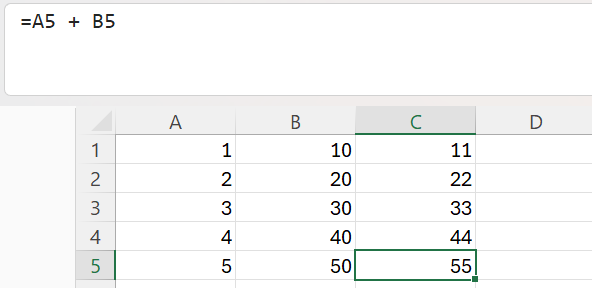
</details>

<details>
<summary><strong>Cas 2 — La référence absolue</strong></summary>

Un coefficient placé en `D1`, référencé de manière absolue.

```excel
=A1*$D$1
```

`$D$1` reste identique dans toutes les cellules recopiées, quelle que soit la direction.

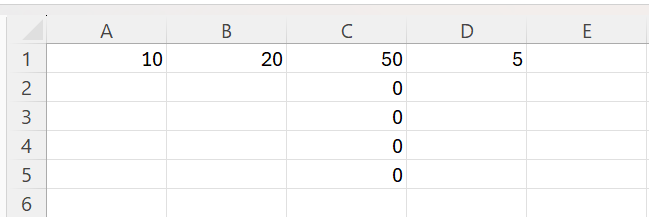
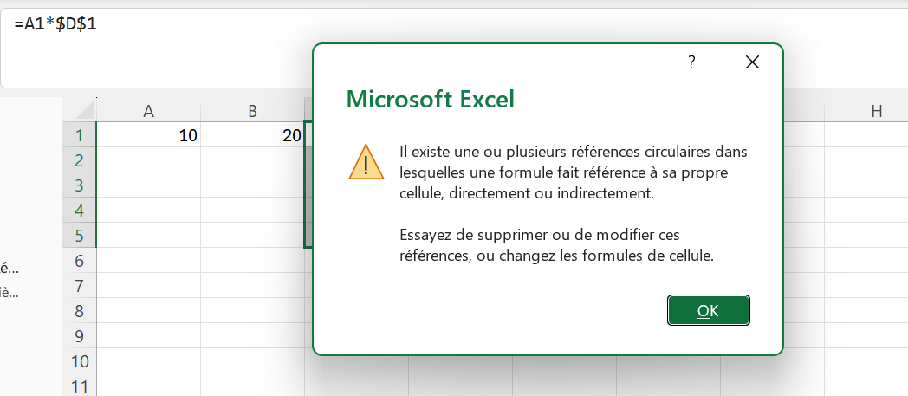
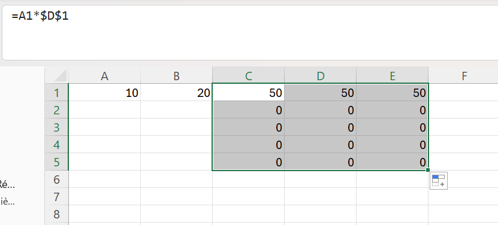
</details>

<details>
<summary><strong>Cas 3 — Les références mixtes</strong></summary>

Une table de multiplication construite avec une formule unique.

```excel
=$A2*B$1
```

| Cellule | Formule obtenue | Ce qui a glissé |
|:---|:---|:---|
| `B2` | `=$A2*B$1` | formule d'origine |
| `E2` | `=$A2*E$1` | la colonne |
| `B5` | `=$A5*B$1` | la ligne |
| `E5` | `=$A5*E$1` | les deux |

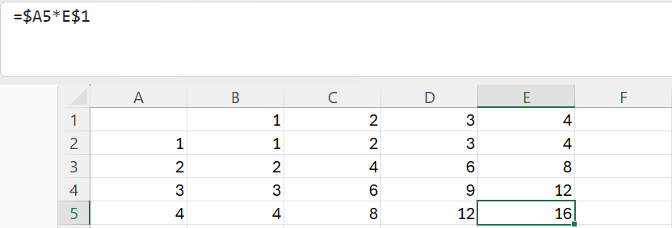
</details>

<details>
<summary><strong>Cas 4 — Total HT d'un tableau produits</strong></summary>

```excel
=B2*C2
```

Chaque ligne possède son propre prix et sa propre quantité : la référence relative est le seul choix correct.

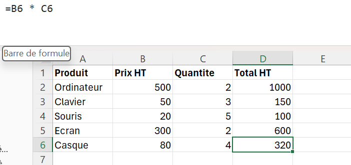
</details>

<details>
<summary><strong>Cas 5 — Prix TTC avec taux de TVA fixe</strong></summary>

```excel
=D2*(1+$H$2)
```

`D2` change à chaque ligne (donnée propre au produit) · `$H$2` ne bouge jamais (taux commun à tout le tableau).

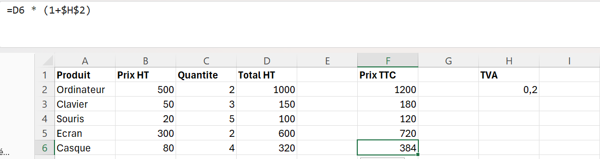
</details>

<details>
<summary><strong>Cas 6 — Matrice de sensibilité</strong></summary>

Trois scénarios de TVA en ligne 1, cinq produits en colonnes : **une seule formule alimente les 15 cellules**.

```excel
=$D2*(1+J$1)
```

| Cellule | Formule obtenue | Ce qui a glissé |
|:---|:---|:---|
| `J2` | `=$D2*(1+J$1)` | formule d'origine |
| `K2` | `=$D2*(1+K$1)` | la colonne |
| `J6` | `=$D6*(1+J$1)` | la ligne |
| `L6` | `=$D6*(1+L$1)` | les deux |

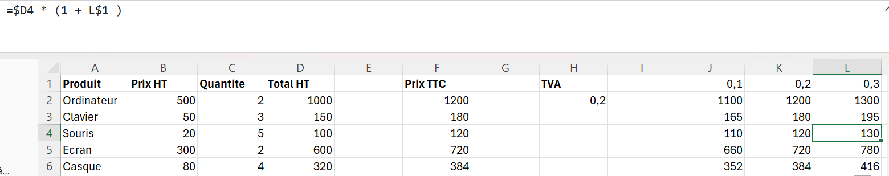
</details>

<details>
<summary><strong>Cas 7 — Le raccourci F4</strong></summary>

Pendant l'édition d'une formule, `F4` (ou `Fn + F4`) fait défiler les quatre modes :

```text
=A1  →  =$A$1  →  =A$1  →  =$A1  →  =A1
```

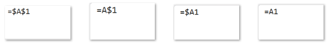
</details>

<details>
<summary><strong>Cas 8 — Figer des valeurs aléatoires</strong></summary>

```excel
=ENT(ALEA()*10)+1
```

`ALEA()` est une **fonction volatile** : elle est recalculée à chaque événement de recalcul du classeur (touche `F9`, modification d'une cellule, réouverture du fichier), et non uniquement quand ses arguments changent.

**Avant** — la colonne contient des formules, les valeurs changent à chaque recalcul :

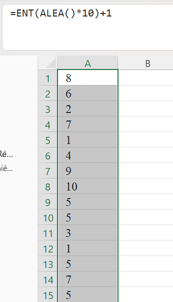

**L'opération** — `Copier` puis `Collage spécial › Valeurs` :

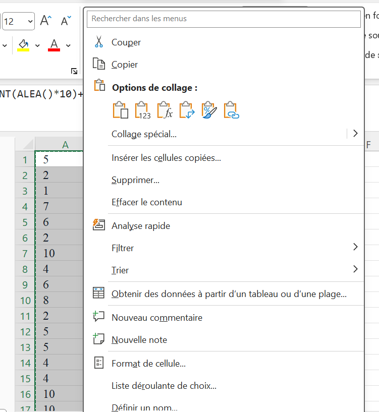

**Après** — la cellule ne contient plus `=ENT(ALEA()*10)+1` mais son résultat, par exemple `7`. Excel n'ayant plus de formule à recalculer, la valeur est définitivement figée :

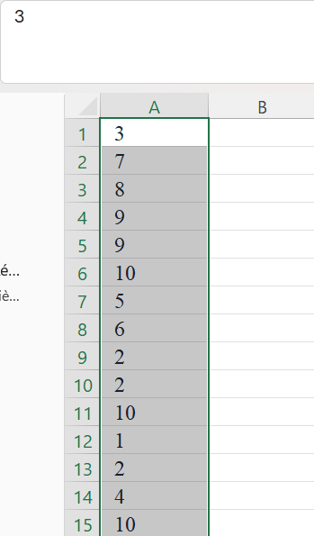

> ⚠️ **Piège rencontré :** le presse-papiers doit rester intact entre le *Copier* et le *Collage spécial*. Une capture d'écran, un appui sur `Échap` ou une saisie intermédiaire vident le presse-papiers d'Excel — la boîte de dialogue devient alors celle de Windows (*Image PNG, Bitmap, HTML*) et l'option **Valeurs** disparaît.

🏢 **Contextes où le figement est indispensable :** rapport diffusé, archivage et audit, jeu de données de test, résultats de simulation, données servant de clé à des recherches ou à des tris.
</details>

---

## ⚡ Mémo des raccourcis

| Raccourci | Action |
|:---|:---|
| `F4` (ou `Fn + F4`) | Basculer entre les 4 types de référence pendant l'édition |
| `F9` (ou `Fn + F9`) | Forcer le recalcul du classeur |
| `Ctrl + Alt + V` | Ouvrir le Collage spécial |
| `Ctrl + B` | Recopier vers le bas |
| `Ctrl + D` | Recopier vers la droite |
| Double-clic sur la poignée | Propager la formule jusqu'à la dernière ligne |
| <code>Ctrl + `</code> | Afficher / masquer toutes les formules |

---

## 💡 Ce que j'ai retenu

Le réflexe à adopter devant chaque formule :

> **« Si je recopie cette formule, qu'est-ce qui doit bouger et qu'est-ce qui doit rester fixe ? »**

À partir de cette question, le choix devient mécanique :

```text
A1      →  tout est relatif
$A$1    →  tout est fixe
$A1     →  colonne fixe, ligne variable
A$1     →  colonne variable, ligne fixe
```

### 🐛 Erreur rencontrée et correction

En recopiant la plage `C1:C5` vers la droite, la cellule `D1` contenant le coefficient a été **écrasée** : elle faisait partie de la zone de destination.

✅ **Correction adoptée :** isoler les paramètres (taux, coefficients, seuils) dans une zone dédiée du classeur, voire dans une feuille `Paramètres` distincte, pour qu'aucune recopie ne puisse les atteindre.

---

## 📁 Contenu du dossier

```text
J01-References-cellules/
│
├── README.md                    ← ce fichier
│
├── recherches/
│   ├── Jour1_Excel_References_Ndeye_Penda_SARR.docx
│   └── Jour1_Excel_References_Ndeye_Penda_SARR.pdf
│
├── exercices/
│   └── Classeur-J01.xlsx
│
└── captures/
    ├── cp1-reference-relative.png
    ├── cp2-reference-absolue-1.png
    ├── cp2-reference-absolue-2.png
    ├── cp2-reference-absolue-3.png
    ├── cp3-references-mixtes.png
    ├── cp4-total-ht.png
    ├── cp5-tva-fixe.png
    ├── cp6-matrice-sensibilite.png
    ├── cp7-raccourci-f4.png
    ├── cp8-avant-collage.png
    ├── cp8-collage-special.png
    └── cp8-apres-collage.png
```

---

## ✅ Statut

**Jour 1 terminé et validé.**
Compétence principale acquise : *concevoir des formules Excel en maîtrisant le comportement des références relatives, absolues et mixtes lors de la recopie.*

---

<sub>Ndeye Penda SARR — Apprenante Promotion 8, Développement Data · Orange Digital Center · 2026</sub>