# 📗 Jour 2 — Mise en forme essentielle

<p>
  
  
  
  
</p>

> **En une phrase :** le format change ce que l'on voit, jamais ce qu'Excel calcule.

[⬅️ Retour au Sprint 1](../README.md) · [🏠 Sommaire du bootcamp](../../README.md)

---

## 📎 Livrables

| Fichier | Description |
|:---|:---|
| [📕 Rapport complet (PDF)](./documentation/Jour2_Excel_Mise_en_forme_Ndeye_Penda_SARR.pdf) | Version illustrée et détaillée, lisible directement dans GitHub |
| [📝 Rapport complet (Word)](./documentation/Jour2_Excel_Mise_en_forme_Ndeye_Penda_SARR.docx) | Version éditable du rapport |
| [📊 Classeur Excel](./exercices/Classeur-J02.xlsx) | Les 3 exercices et le mini-projet bulletin scolaire |
| [📸 Captures](./captures/) | 16 preuves visuelles des manipulations |

---

## 🎯 Objectifs de la journée

Utiliser la mise en forme d'Excel de manière fonctionnelle et professionnelle, pour rendre les données lisibles **sans modifier les valeurs stockées**.

- Distinguer une valeur de son format d'affichage
- Formater correctement nombres, pourcentages, devises et dates
- Créer un format personnalisé adapté au contexte local (FCFA)
- Améliorer la lisibilité d'un tableau : largeur, alignement, bordures, en-têtes
- Comprendre les bons usages — et les pièges — de la fusion de cellules

---

## 🧩 La notion clé de la journée : valeur ≠ affichage

| Valeur réellement stockée | Format appliqué | Ce que l'on voit |
|:---|:---|:---|
| `16,75` | Nombre, 2 décimales | `16,75` |
| `0,95` | Pourcentage | `95 %` |
| `75000` | Personnalisé `# ##0" FCFA"` | `75 000 FCFA` |
| `15/01/2026` | Date `jj/mm/aaaa` | `15/01/2026` |

⚠️ **Le format est une couche d'affichage.** Excel continue de calculer sur la valeur stockée : une cellule affichant `95 %` contient bien `0,95`, et une cellule affichant `75 000 FCFA` reste un nombre utilisable dans une somme. C'est exactement ce qui différencie un formatage d'une saisie de texte du type `"75000 FCFA"`, qui casserait tous les calculs.

---

## 🎨 Les formats utilisés

| Format | Code / accès | Exemple obtenu | Quand l'utiliser |
|:---|:---|:---|:---|
| Nombre | 2 décimales | `15,50` | Notes, mesures, montants décimaux |
| Pourcentage | Bouton `%` | `95 %` | Taux, parts, progressions |
| Personnalisé | `# ##0" FCFA"` | `75 000 FCFA` | Devises non proposées par défaut |
| Date | `jj/mm/aaaa` | `15/01/2026` | Dates d'inscription, échéances |

💡 **Pourquoi un format personnalisé pour le FCFA ?** Excel ne propose pas le franc CFA dans sa liste de devises. Le code `# ##0" FCFA"` ajoute le séparateur de milliers et le suffixe, tout en gardant un vrai nombre dans la cellule.

---

## 🧪 Exercices réalisés

<details>
<summary><strong>Exercice 1 — Les formats indispensables</strong></summary>

Point de départ : un tableau de 20 étudiants aux données brutes, sans aucun format.

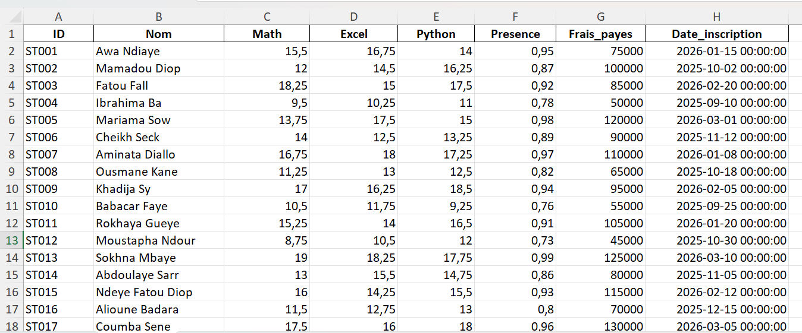

L'accès au formatage se fait par clic droit › **Format de cellule**, ou par `Ctrl + 1`.

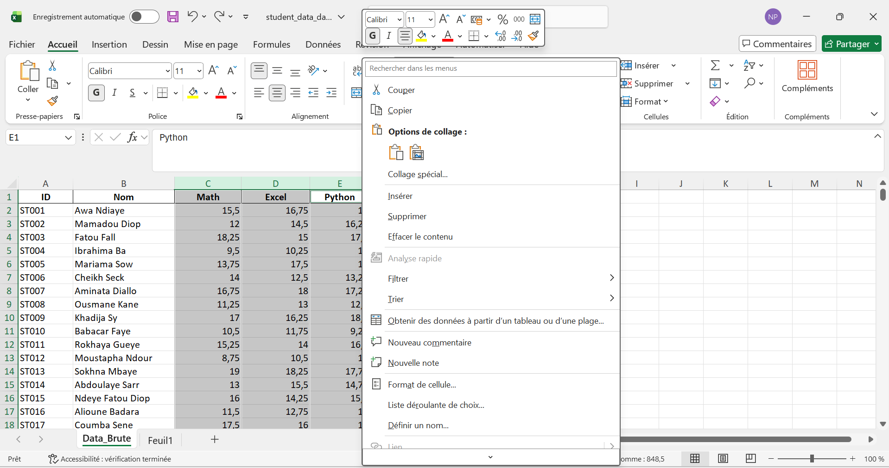

**➊ Les notes en nombre à 2 décimales**

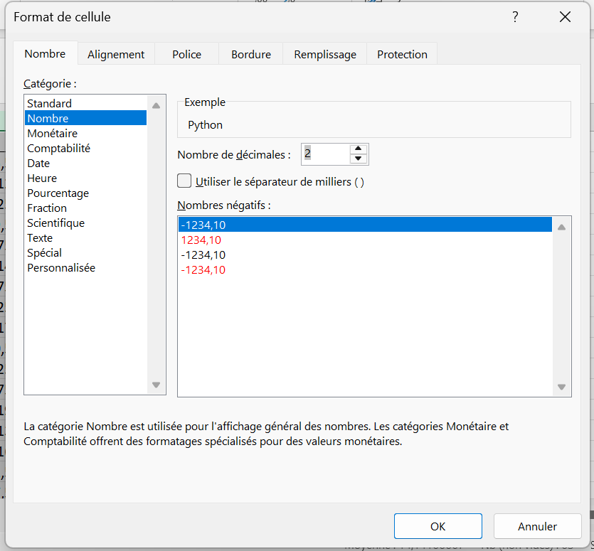
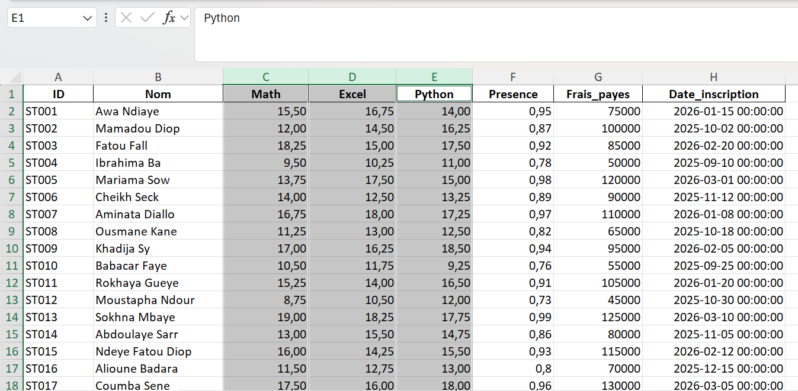

**➋ La présence en pourcentage** — la valeur `0,95` s'affiche `95 %`

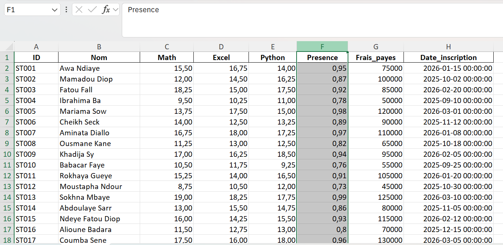
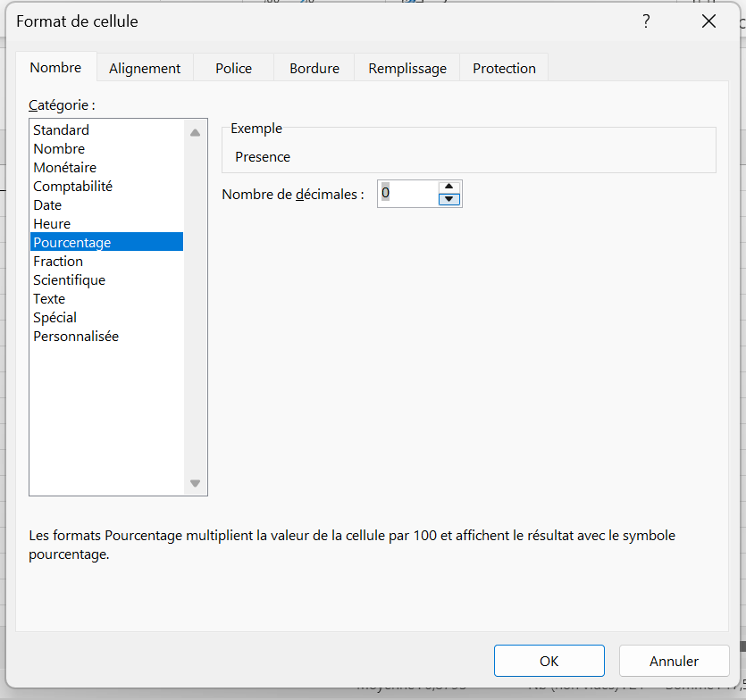
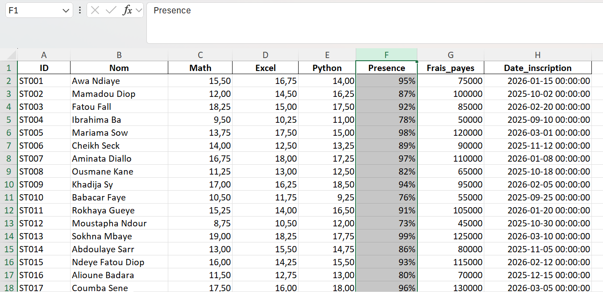

**➌ Les frais en FCFA** — format personnalisé `# ##0" FCFA"`

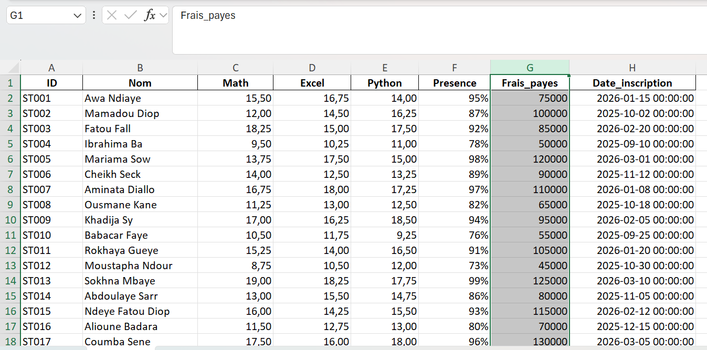
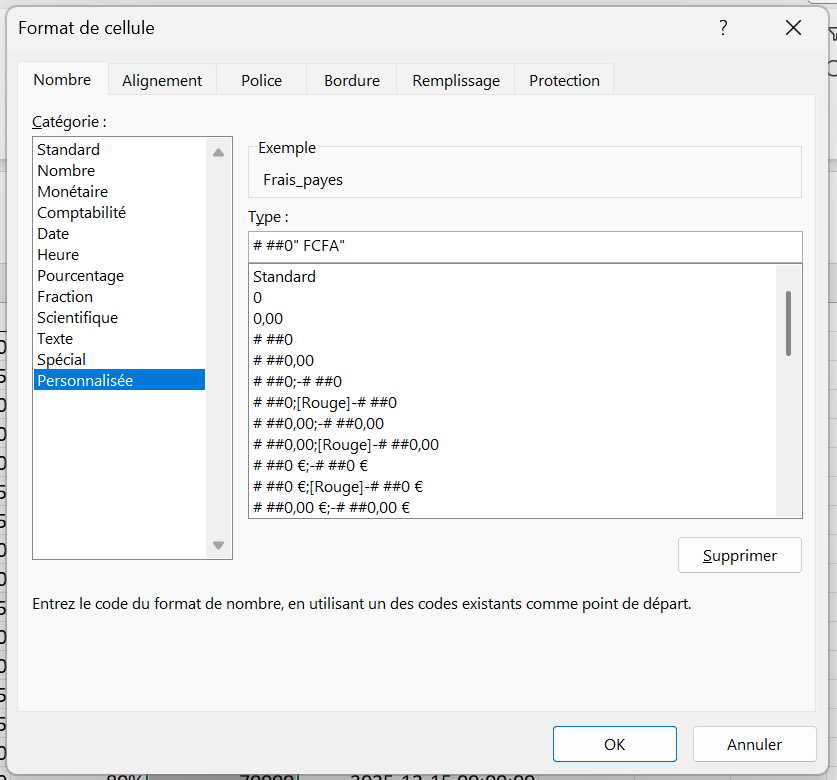
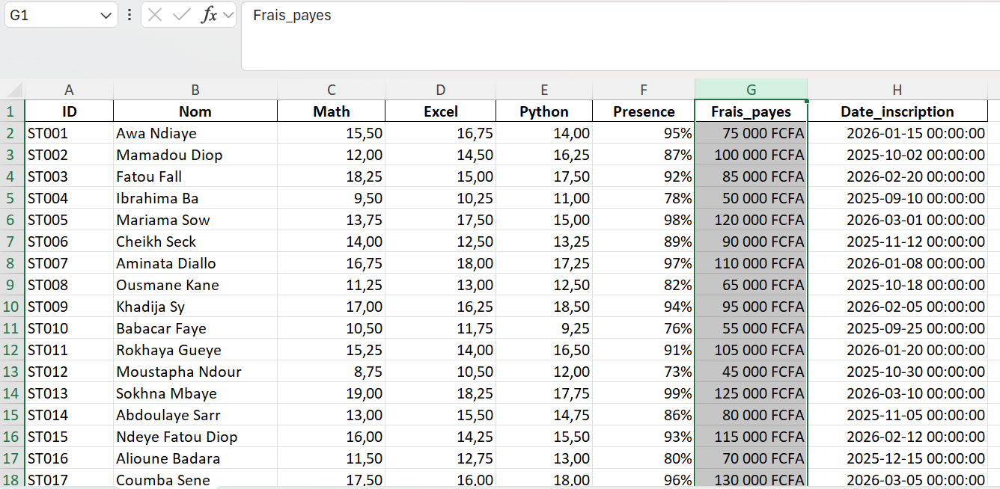

**➍ Les dates d'inscription** au format `jj/mm/aaaa`

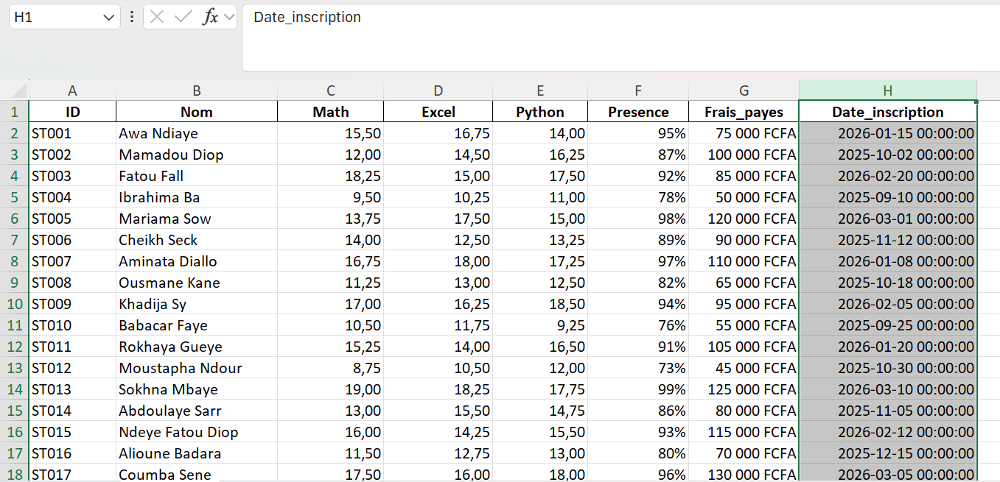
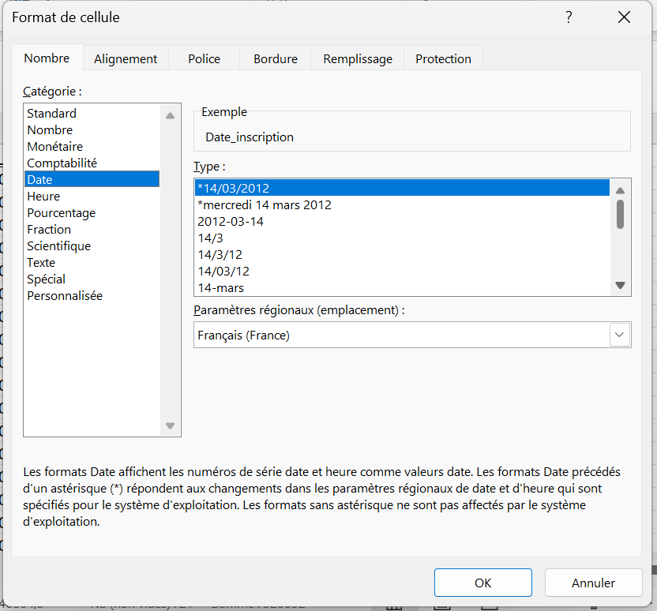
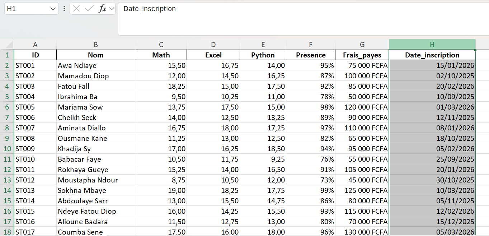
</details>

<details>
<summary><strong>Exercice 2 — Rendre le tableau lisible</strong></summary>

En-têtes en gras, largeur des colonnes ajustée, alignement cohérent, bordures et uniformisation des formats sur l'ensemble du tableau.

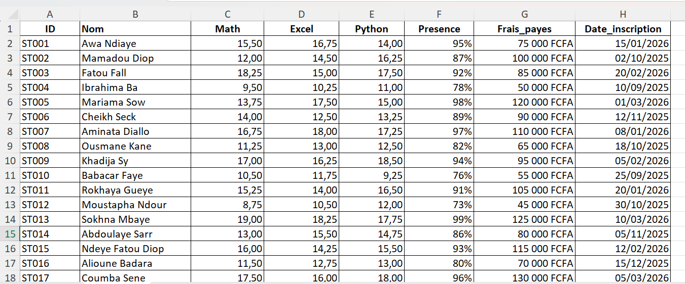

📐 **Règle d'alignement retenue :** les nombres à droite, le texte à gauche, les en-têtes centrés. L'œil compare beaucoup plus vite des chiffres alignés sur leur unité.
</details>

<details>
<summary><strong>Exercice 3 — La fusion de cellules</strong></summary>

Titre `BULLETIN DES ÉTUDIANTS — BOOTCAMP DATA` fusionné et centré au-dessus du tableau.

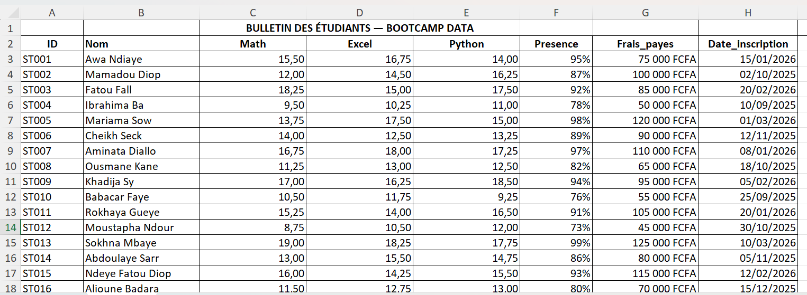

⚠️ **Le piège de la fusion :** elle est acceptable pour un **titre décoratif**, jamais à l'intérieur de données structurées. Une plage fusionnée casse le tri, perturbe les filtres, empêche la sélection d'une colonne entière et rend le tableau inexploitable par un tableau croisé dynamique.

✅ **L'alternative propre :** `Format de cellule › Alignement › Centrer sur plusieurs colonnes`. Le rendu visuel est identique, mais les cellules restent indépendantes.
</details>

<details>
<summary><strong>Mini-projet — Bulletin scolaire</strong></summary>

Une feuille `Bulletin` regroupant l'en-tête, les résultats (Math, Excel, Python) et les informations complémentaires : présence, frais payés, date d'inscription. Chaque colonne porte le format adapté à sa nature.

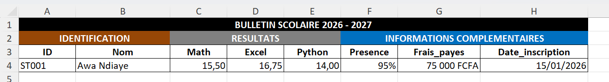
</details>

---

## ⚡ Mémo des raccourcis

| Raccourci | Action |
|:---|:---|
| `Ctrl + 1` | Ouvrir la boîte **Format de cellule** |
| `Ctrl + Maj + 1` | Format nombre à 2 décimales |
| `Ctrl + Maj + 5` | Format pourcentage |
| `Ctrl + Maj + 3` | Format date |
| `Ctrl + G` | Mettre en gras |
| `Alt + Entrée` | Retour à la ligne dans une cellule |
| Double-clic sur la bordure d'en-tête | Ajuster la largeur au contenu |

---

## 💡 Ce que j'ai retenu

Un tableau bien formaté n'est pas une question d'esthétique : c'est une question de **fiabilité de lecture**. Un montant sans séparateur de milliers ou une date ambiguë obligent le lecteur à un effort d'interprétation, et l'effort d'interprétation est précisément là où naissent les erreurs.

Le réflexe à adopter :

> **« Est-ce que je change l'affichage, ou est-ce que je change la donnée ? »**

Si la réponse est « la donnée », c'est probablement une erreur. Taper `95 %` à la main dans une cellule produit du texte ; appliquer le format pourcentage à `0,95` produit un nombre.

### 🐛 Point de vigilance rencontré

La fusion de cellules est tentante parce qu'elle rend un tableau joli tout de suite. C'est le piège classique du débutant : le fichier devient inexploitable dès qu'on veut trier, filtrer ou construire une analyse dessus. À réserver strictement aux titres.

---

## 📁 Contenu du dossier

```text
J02-Mise-en-forme-essentielle/
│
├── README.md                    ← ce fichier
│
├── documentation/
│   ├── Jour2_Excel_Mise_en_forme_Ndeye_Penda_SARR.docx
│   └── Jour2_Excel_Mise_en_forme_Ndeye_Penda_SARR.pdf
│
├── exercices/
│   └── Classeur-J02.xlsx
│
└── captures/
    ├── 01-donnees-brutes-avant-formatage.png
    ├── ...
    └── 16-mini-projet-bulletin-scolaire.png
```

---

## ✅ Statut

**Jour 2 terminé et validé.**
Compétence principale acquise : *mettre en forme un tableau de manière professionnelle en distinguant la valeur stockée de son format d'affichage.*

---

<sub>Ndeye Penda SARR — Apprenante Promotion 8, Développement Data · Orange Digital Center · 2026</sub>
