# 📗 Jour 4 — Validation des données

<p>
  
  
  
  
</p>

> **En une phrase :** la validation des données ne corrige rien après coup — elle empêche l'erreur d'entrer dans le tableau.

[⬅️ Retour au Sprint 1](../README.md) · [🏠 Sommaire du bootcamp](../../README.md)

---

## 📎 Livrables

| Fichier | Description |
|:---|:---|
| [📕 Rapport complet (PDF)](./documentation/Jour4_Excel_Validation_Donnees_Ndeye_Penda_SARR.pdf) | Version illustrée et détaillée, lisible directement dans GitHub |
| [📝 Rapport complet (Word)](./documentation/Jour4_Excel_Validation_Donnees_Ndeye_Penda_SARR.docx) | Version éditable du rapport |
| [📊 Classeur Excel](./exercices/Classeur-J04.xlsx) | Les 4 exercices et le mini-projet |
| [📸 Captures](./captures/) | 29 preuves visuelles des manipulations |

---

## 🎯 Objectifs de la journée

- Créer une liste déroulante pour limiter la saisie à des choix prédéfinis
- Restreindre une cellule à un nombre décimal compris dans une plage donnée
- Restreindre une cellule à un nombre entier compris dans une plage donnée
- Contrôler la saisie d'une date dans une période déterminée
- Utiliser un message de saisie pour guider l'utilisateur avant qu'il ne tape
- Configurer une alerte d'erreur personnalisée pour bloquer une valeur incorrecte
- Combiner plusieurs règles de validation dans un même formulaire

---

## 🧩 La notion clé de la journée

| | Sans validation | Avec validation |
|:---|:---|:---|
| **Contrôle** | Aucun — tout est accepté | Une règle filtre ce qui peut être saisi |
| **Erreurs typiques** | `Data`, `data`, `DATA`, `Datta` cohabitent | Une seule orthographe possible, via liste |
| **Moment d'action** | Après coup, en nettoyant | Au moment même de la saisie |
| **Effet sur l'analyse** | Tris, filtres et TCD faussés | Données homogènes, exploitables directement |

⚠️ **Le piège de la journée :** une règle de validation qui semble fonctionner sur une cellule ne garantit rien sur les autres. Chaque champ (liste, nombre, date) a son propre type de critère — les mélanger ou oublier l'alerte d'erreur laisse une porte ouverte à une saisie invalide.

---

## 🧪 Exercices réalisés

<details>
<summary><strong>Exercice 1 — Créer une liste déroulante</strong></summary>

Objectif : dans la cellule B2, limiter la saisie à une filière parmi `Data`, `Développement`, `Cybersécurité`, `IA`.

**➊ Configuration de la règle** — Données › Validation des données › Autoriser : Liste, Source séparée par des points-virgules

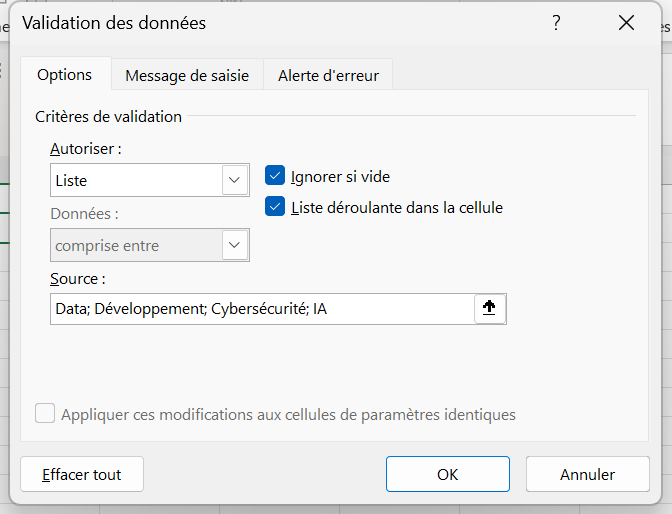

**➋ Résultat** — une liste déroulante apparaît directement dans la cellule

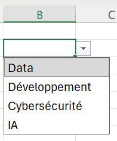

**➌ Test avec une valeur hors liste** (`NPS`)

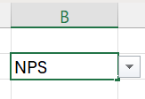
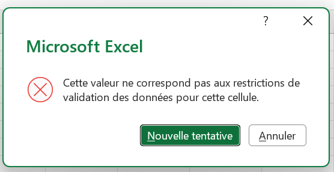

Excel refuse la saisie et affiche le message d'erreur générique tant qu'aucun message personnalisé n'a été configuré.
</details>

<details>
<summary><strong>Exercice 2 — Limiter une note entre 0 et 20</strong></summary>

Objectif : dans la cellule B4, n'autoriser qu'un nombre décimal compris entre 0 et 20, avec un message d'erreur personnalisé.

**➊ Configuration** — Autoriser : Décimal, comprise entre 0 et 20

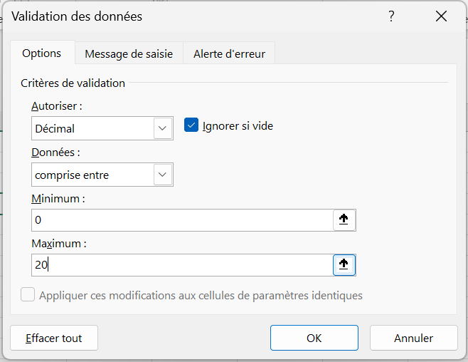

**➋ Test avec `-7`**

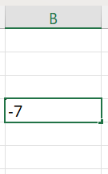
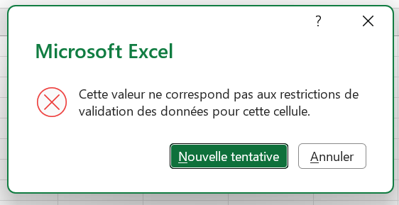

**➌ Personnalisation de l'alerte** — onglet Alerte d'erreur, style Stop, titre *Saisie Incorrecte*

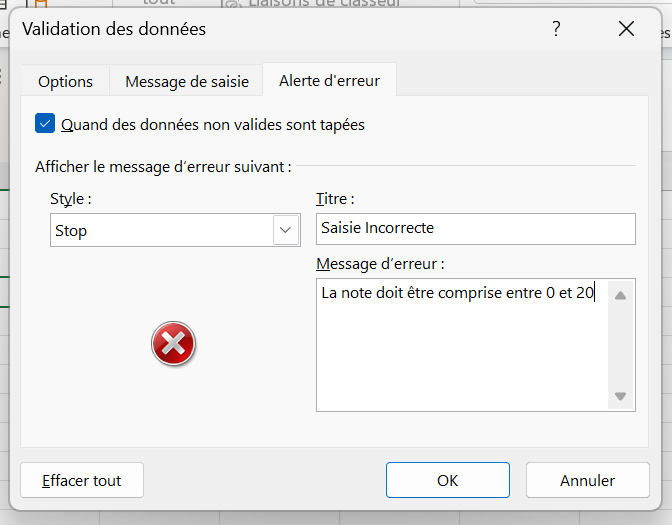

**➍ Résultat avec le message personnalisé** (test avec `-2`)

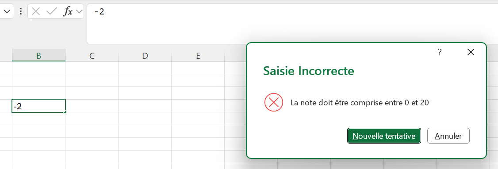

💡 Le style **Stop** empêche totalement la validation de la cellule tant que la valeur ne respecte pas la règle — d'autres styles (Avertissement, Information) laissent l'utilisateur passer outre.
</details>

<details>
<summary><strong>Exercice 3 — Limiter un âge entre 18 et 60 ans</strong></summary>

Objectif : dans la cellule B6, n'autoriser qu'un nombre entier compris entre 18 et 60.

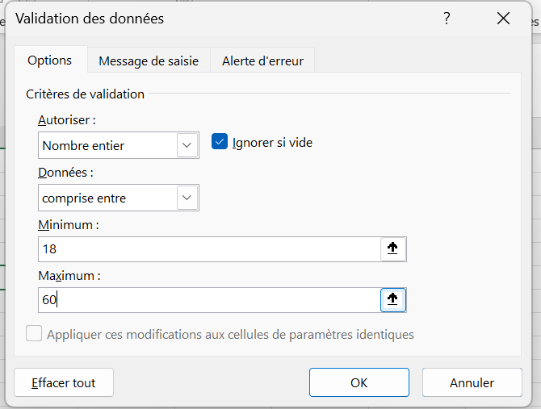

**Test avec `12`**

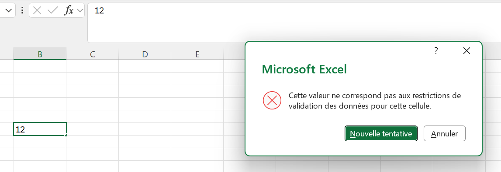

🔁 Seule différence avec l'exercice précédent : le choix de **Nombre entier** au lieu de **Nombre décimal** dans le champ Autoriser — le reste de la logique (plage, alerte) est identique.
</details>

<details>
<summary><strong>Exercice 4 — Contrôler une date</strong></summary>

Objectif : dans la cellule B8, n'autoriser qu'une date comprise entre le 01/01/2025 et le 31/12/2026, avec un message de saisie.

**➊ Configuration de la plage de dates**

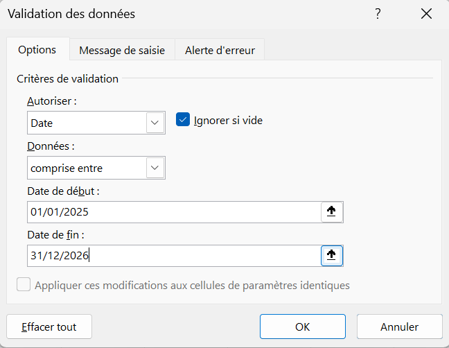

**➋ Configuration du message de saisie** — onglet Message de saisie

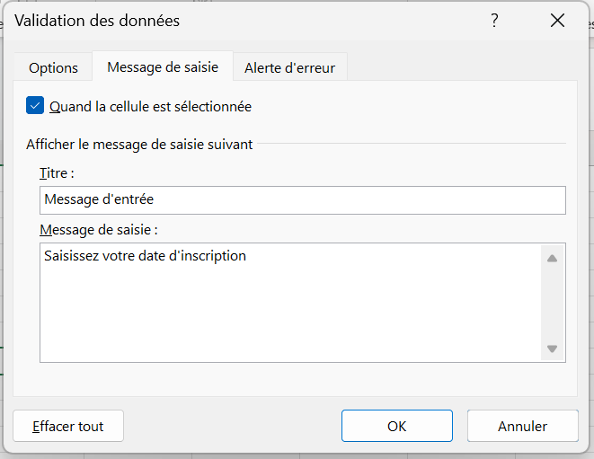

**➌ Résultat** — l'info-bulle apparaît dès que la cellule est sélectionnée, avant même toute saisie

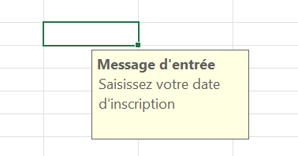

📌 Contrairement au message d'erreur, le message de saisie n'intervient jamais en cas de refus : il guide **avant**, il ne sanctionne jamais.
</details>

---

## 🎯 Mini-projet — Formulaire d'inscription

Objectif : réunir toutes les règles apprises dans un formulaire complet à 8 champs (Nom complet, Sexe, Âge, Ville, Filière, Niveau, Date d'inscription, Email).

| Champ | Type de validation |
|:---|:---|
| Nom complet | Texte libre |
| Sexe | Liste déroulante |
| Âge | Entier entre 18 et 60 |
| Ville | Liste déroulante |
| Filière | Liste déroulante |
| Niveau | Liste déroulante |
| Date d'inscription | Date valide |
| Email | Texte libre |

**➊ Les quatre listes déroulantes du formulaire**

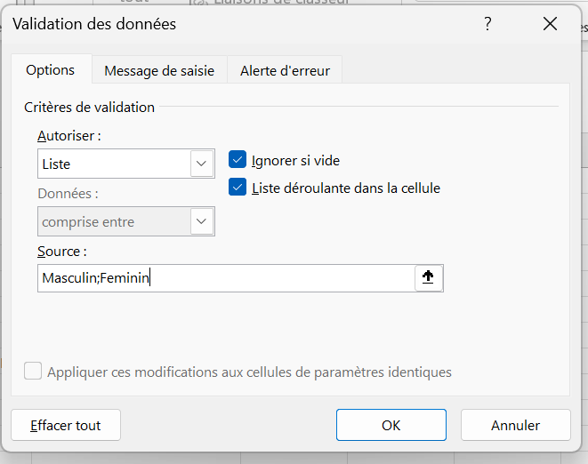
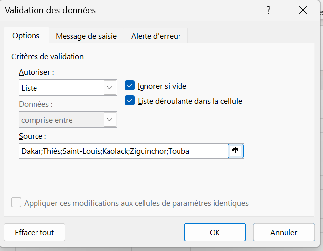
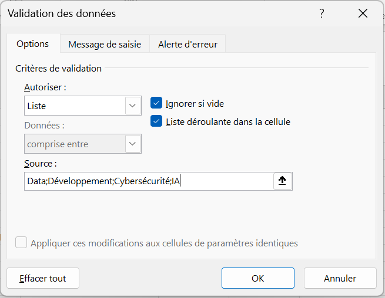
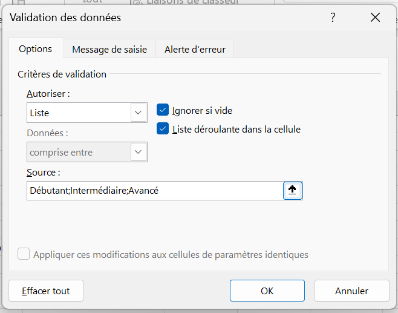

**➋ Le champ Âge, avec alerte d'erreur personnalisée** (« Saisie Invalide » / *Veuillez saisir un âge compris entre 18 et 60 ans.*)

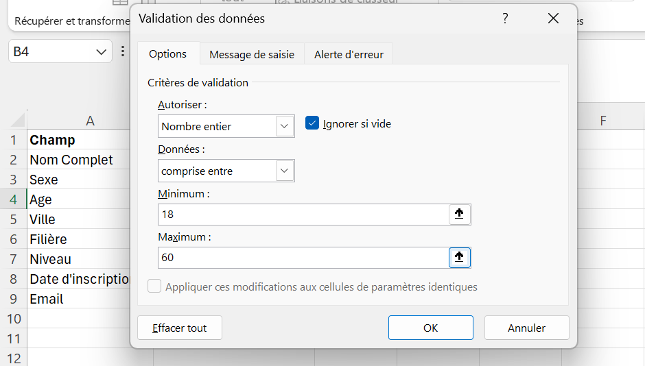
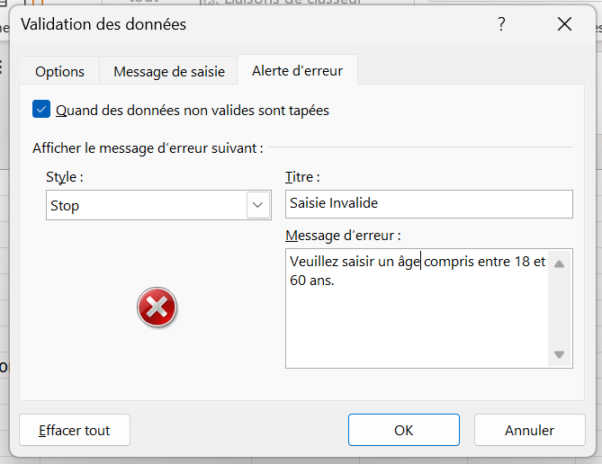

**➌ Le champ Date d'inscription**, borné à septembre 2026 avec son propre message de saisie

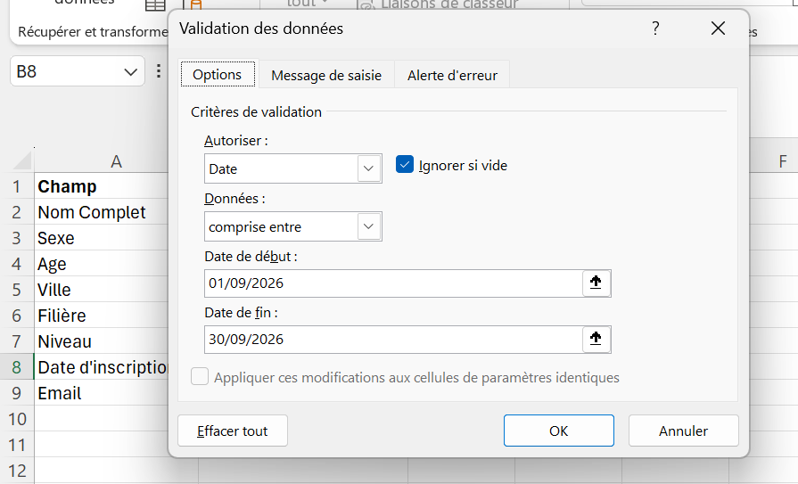
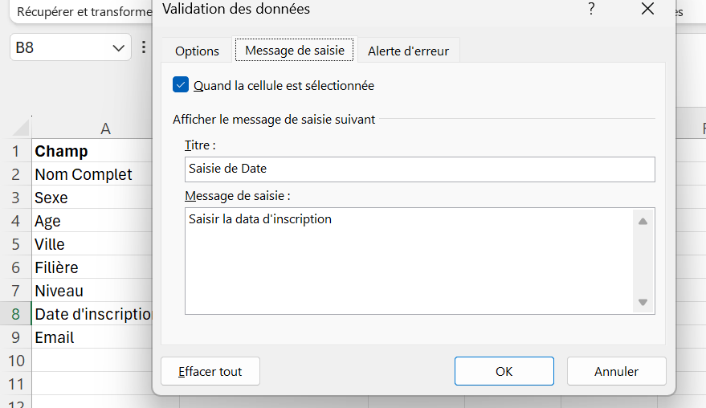

**➍ Test du formulaire en conditions réelles**

Une saisie d'âge invalide (`1`) déclenche bien l'alerte configurée :

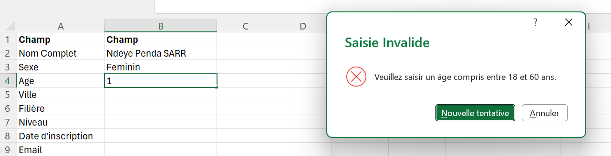

Puis remplissage complet du formulaire, liste par liste :

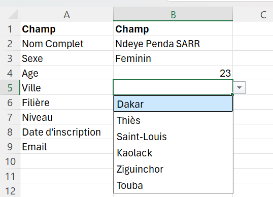
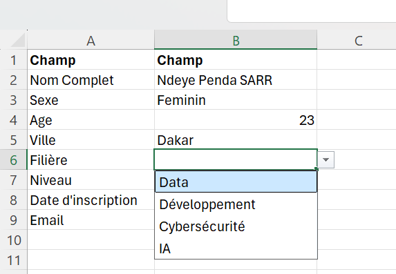
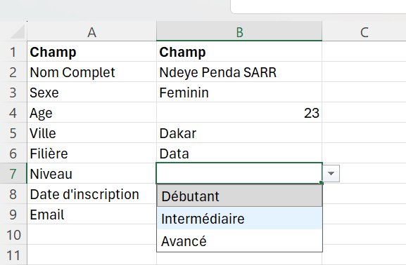
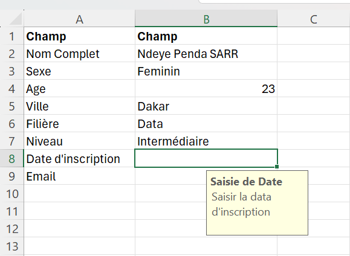

**➎ Formulaire final rempli**

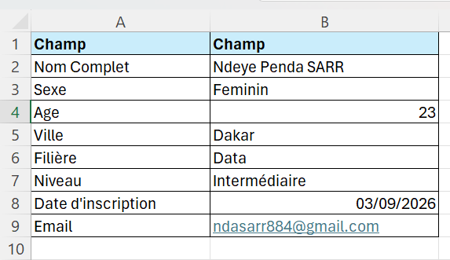

✅ Les huit champs respectent leurs règles respectives : listes, plage numérique et date valide fonctionnent simultanément sur un même formulaire.

---

## ⚡ Mémo des types de validation

| Type (Autoriser) | Usage | Exemple du jour |
|:---|:---|:---|
| `Liste` | Choix fermé parmi des valeurs prédéfinies | Sexe, Ville, Filière, Niveau |
| `Nombre décimal` | Valeur numérique avec décimales, plage min/max | Note entre 0 et 20 |
| `Nombre entier` | Valeur numérique entière, plage min/max | Âge entre 18 et 60 |
| `Date` | Date comprise dans une période | Date d'inscription |
| Message de saisie | Info-bulle affichée **avant** la saisie | « Saisissez votre date d'inscription » |
| Alerte d'erreur (Stop) | Message affiché **après** une saisie refusée, bloque la validation | « La note doit être comprise entre 0 et 20 » |

---

## 💡 Points de vigilance retenus

1. **La validation ne modifie jamais une donnée déjà présente** — elle agit uniquement sur les nouvelles saisies.
2. **Liste ≠ texte libre** — une liste déroulante empêche les variantes d'orthographe (`Data` / `data` / `DATA`) qui compliquent ensuite tris et filtres.
3. **Le style d'alerte change tout** — seul le style **Stop** empêche réellement la validation d'une valeur incorrecte.
4. **Message de saisie et message d'erreur ont des rôles opposés** — le premier guide avant, le second sanctionne après.
5. **Un formulaire combine plusieurs types de validation sans conflit**, à condition de configurer chaque champ indépendamment.

---

## 📁 Contenu du dossier

```text
J04-Validation-des-donnees/
│
├── README.md                    ← ce fichier
│
├── documentation/
│   ├── Jour4_Excel_Validation_Donnees_Ndeye_Penda_SARR.docx
│   └── Jour4_Excel_Validation_Donnees_Ndeye_Penda_SARR.pdf
│
├── exercices/
│   └── Classeur-J04.xlsx
│
└── captures/
    ├── 01-dialogue-liste-filiere-source.png
    ├── ...
    └── 29-formulaire-complet-rempli.png
```

---

## ✅ Statut

**Jour 4 terminé et validé.**
Compétence principale acquise : *contrôler une donnée dès sa saisie — listes déroulantes, plages numériques et dates valides — plutôt que de corriger les erreurs après coup.*

---

<sub>Ndeye Penda SARR — Apprenante Promotion 8, Développement Data · Orange Digital Center · 2026</sub>
