# 📘 Jour 5 — Mise en forme conditionnelle

<p>
  
  
  
  
</p>

> **En une phrase :** la mise en forme conditionnelle ne change pas la donnée, elle change ce que l'œil voit en premier — et c'est justement ce qui en fait un outil d'analyse.

[⬅️ Retour au Sprint 1](../README.md) · [🏠 Sommaire du bootcamp](../../README.md)

---

## 📎 Livrables

| Fichier                                                                                                 | Description                                                        |
| :------------------------------------------------------------------------------------------------------ | :----------------------------------------------------------------- |
| [📕 Rapport complet (PDF)](./documentation/Jour5_Excel_MiseEnFormeConditionnelle_Ndeye_Penda_SARR.pdf)   | Version illustrée et détaillée, lisible directement dans GitHub |
| [📝 Rapport complet (Word)](./documentation/Jour5_Excel_MiseEnFormeConditionnelle_Ndeye_Penda_SARR.docx) | Version éditable du rapport                                       |
| [📊 Classeur Excel](./exercices/Classeur-J05.xlsx)                                                       | Les 4 exercices et le mini-projet                                  |
| [📸 Captures](./captures/)                                                                               | 16 preuves visuelles des manipulations                             |

---

## 🎯 Objectifs de la journée

- Créer une règle de mise en forme conditionnelle basée sur un seuil
- Identifier des valeurs inférieures et supérieures ou égales à un seuil
- Corriger la plage d'application d'une règle via le Gestionnaire des règles
- Utiliser une échelle de couleurs pour visualiser des niveaux
- Utiliser des barres de données pour comparer des valeurs
- Utiliser des jeux d'icônes pour une lecture synthétique
- Construire une représentation visuelle cohérente, sans bruit inutile

---

## 🧩 La notion clé de la journée

|                                | Mise en forme classique             | Mise en forme conditionnelle                |
| :----------------------------- | :---------------------------------- | :------------------------------------------ |
| **Déclencheur**         | Choix manuel de l'utilisateur       | Une règle évaluée automatiquement        |
| **Persistance**          | Fixe jusqu'à modification manuelle | Réévaluée à chaque changement de valeur |
| **Effet sur la donnée** | Aucun                               | Aucun — seule l'apparence change           |
| **Sert à**              | Décorer                            | Analyser, repérer, alerter                 |

⚠️ **Le piège de la journée :** une règle appliquée sur une plage entière de colonnes (`=$F:$I`) plutôt que sur la plage réelle des données (`=$F$2:$I$101`) peut déborder sur des lignes qu'elle ne devrait pas toucher, comme l'en-tête. Excel n'affiche aucune erreur — la plage se corrige uniquement dans le Gestionnaire des règles.

---

## 🧪 Exercices réalisés

<details>
<summary><strong>Exercice 1 — Identifier les notes faibles et élevées</strong></summary>

Objectif : sur les colonnes Math, Excel, Python et Statistiques, mettre en évidence les notes inférieures à 10 et les notes supérieures ou égales à 15.

**➊ Notes inférieures à 10** — Règles de mise en surbrillance des cellules › Inférieur à

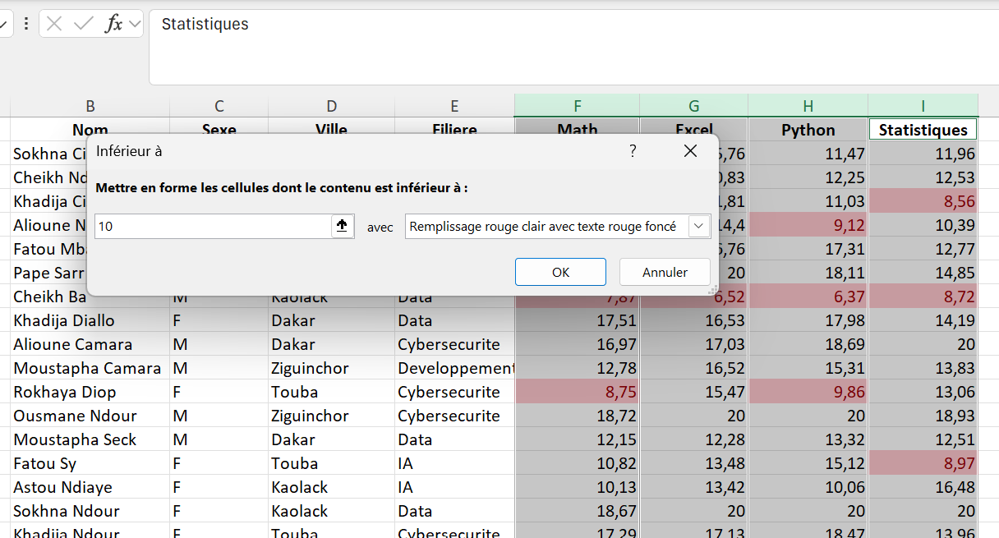

**➋ Notes supérieures ou égales à 15** — cette fois via Nouvelle règle, car ce n'est pas un préréglage standard

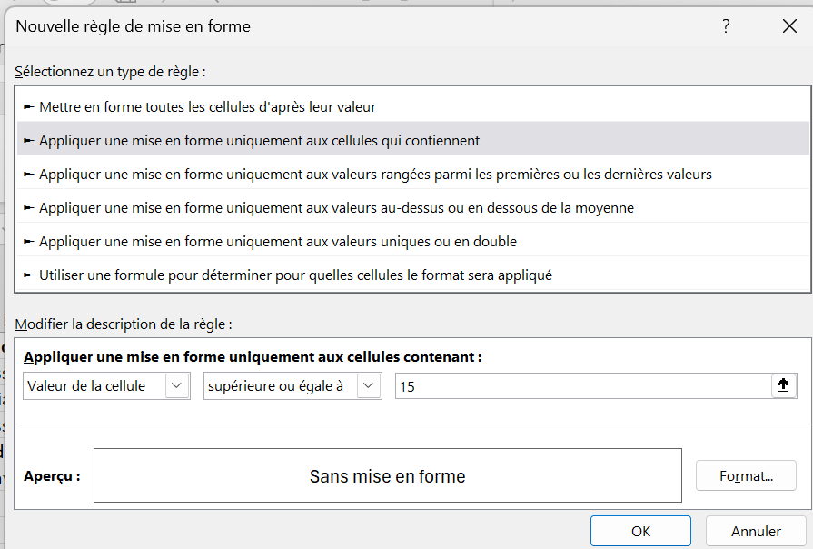

**➌ Choix du format** — remplissage vert

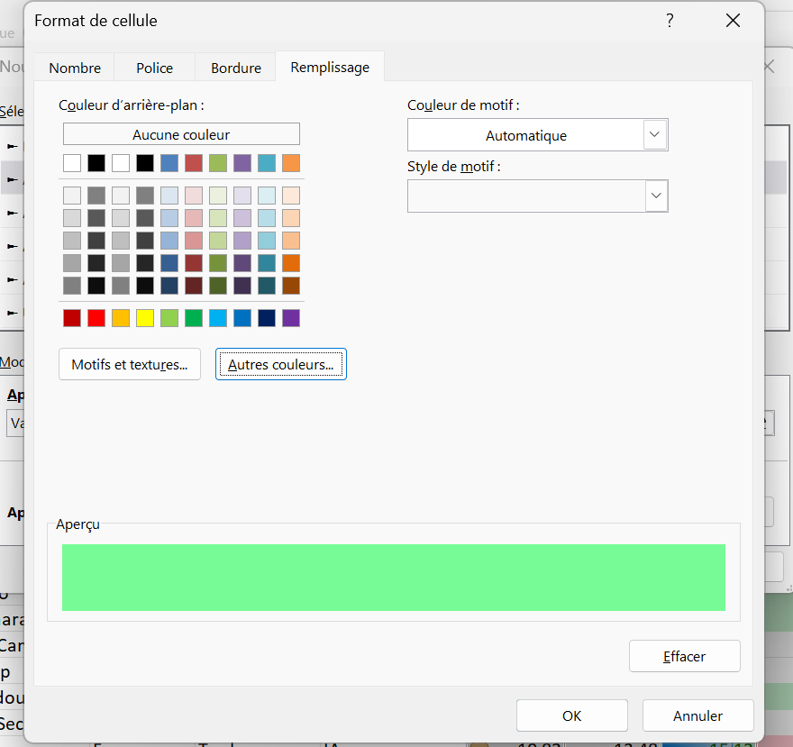
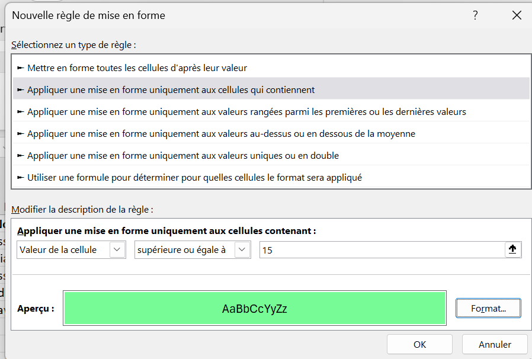

**➍ Résultat sur les quatre colonnes**

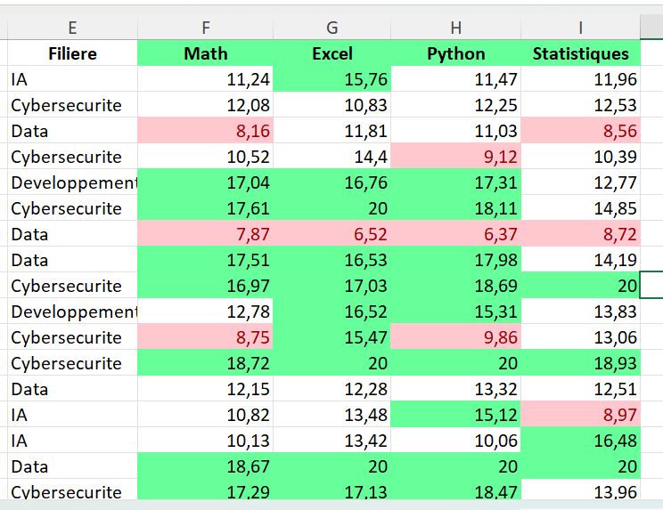

</details>

<details>
<summary><strong>Problème rencontré — la mise en forme s'appliquait à l'en-tête</strong></summary>

En vérifiant la règle dans le Gestionnaire, la plage indiquait `=$F:$I` — la colonne entière, en-tête comprise.

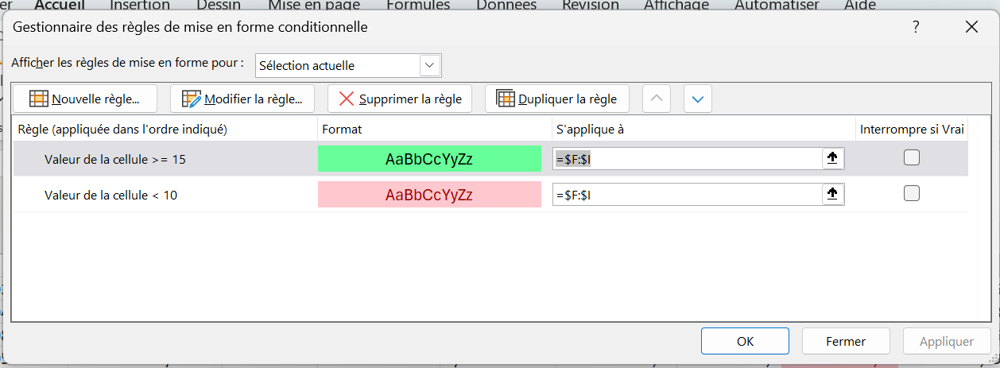

Après correction, la plage démarre à la deuxième ligne : `=$F$2:$I$101`.

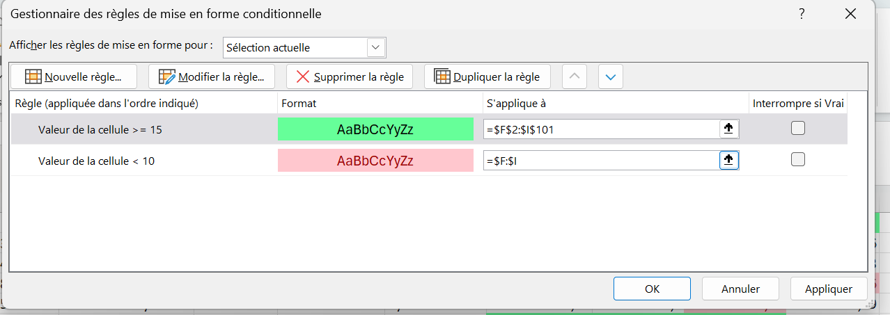
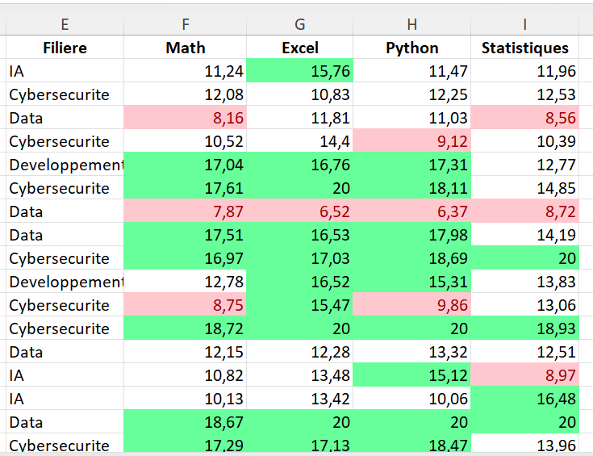

🔑 **Ce que ça change :** une règle ne dépend pas que de sa condition — sa plage d'application fait partie intégrante de sa définition. Le Gestionnaire des règles permet de consulter, modifier et corriger cette plage sans tout recréer.

</details>

<details>
<summary><strong>Exercice 2 — Utiliser une échelle de couleurs</strong></summary>

Objectif : visualiser rapidement les niveaux de présence grâce à une échelle de couleurs (Vert - Jaune - Rouge).

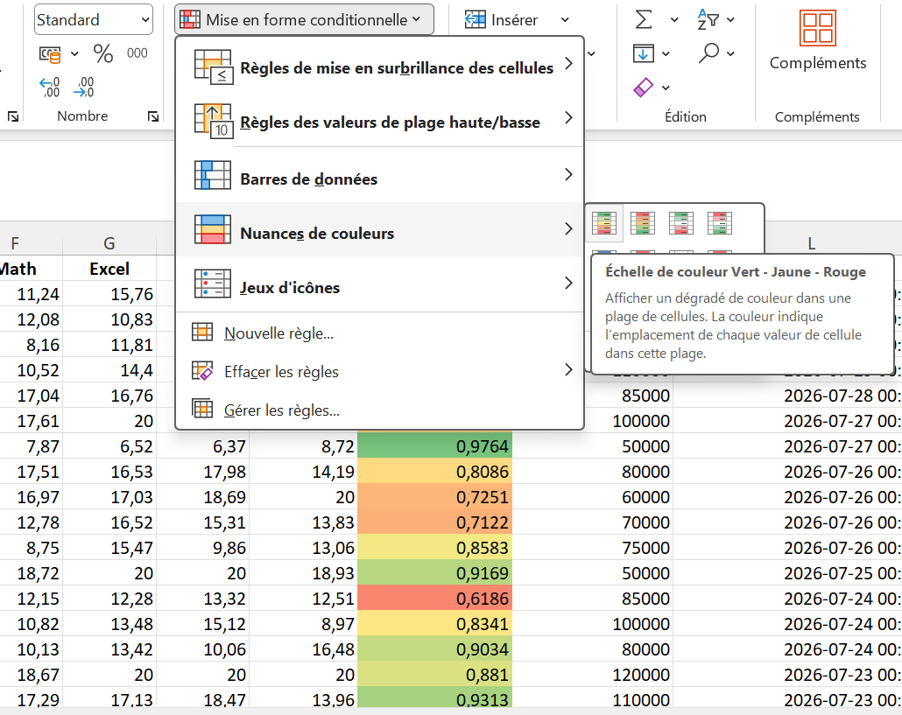
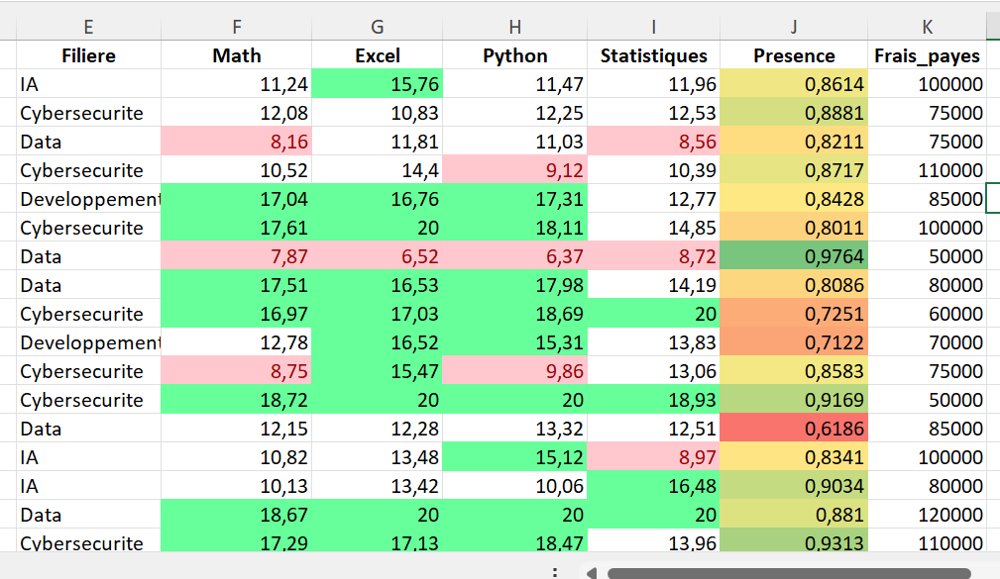

Les valeurs faibles ressortent en rouge, les intermédiaires en jaune et les plus élevées en vert, sans avoir à lire chaque pourcentage individuellement.

</details>

<details>
<summary><strong>Exercice 3 — Utiliser les barres de données</strong></summary>

Objectif : représenter les notes de Python sous forme de barres de données.

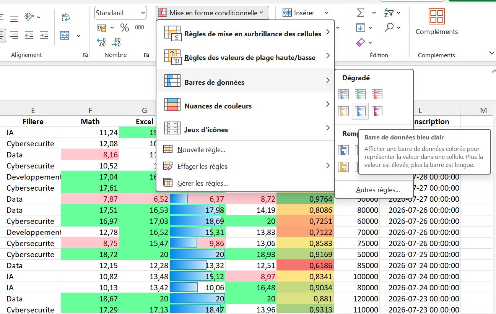
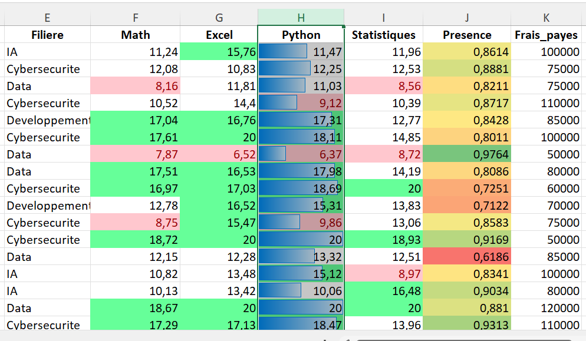

La longueur de chaque barre est proportionnelle à la valeur, ce qui permet de comparer les performances en un coup d'œil, sans lire les nombres.

</details>

<details>
<summary><strong>Exercice 4 — Utiliser les jeux d'icônes</strong></summary>

Objectif : représenter différents niveaux de performance à l'aide d'un jeu d'icônes.

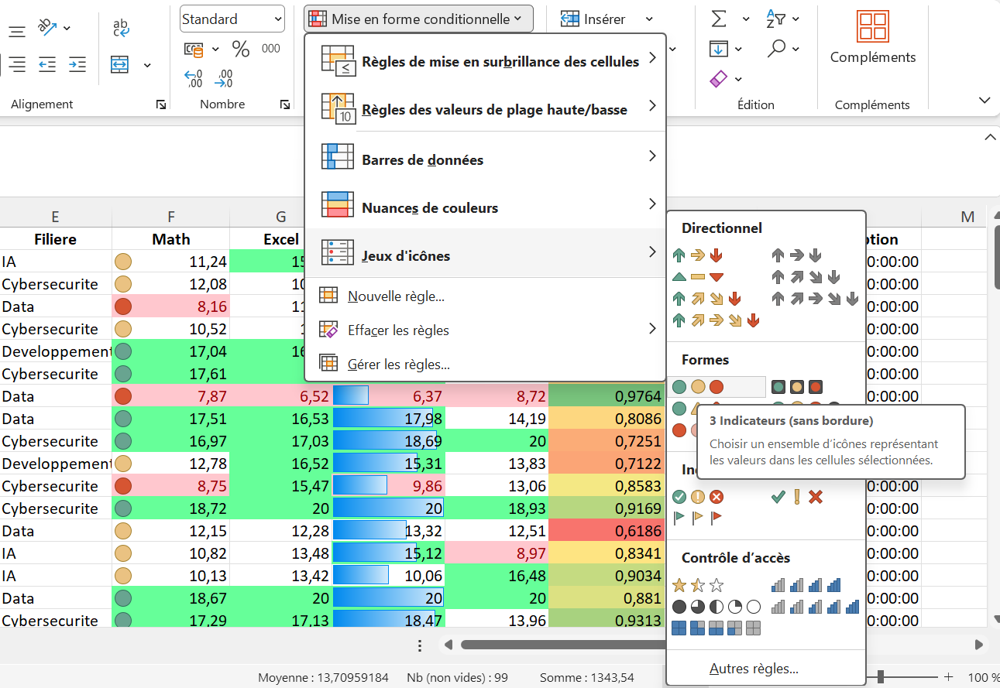
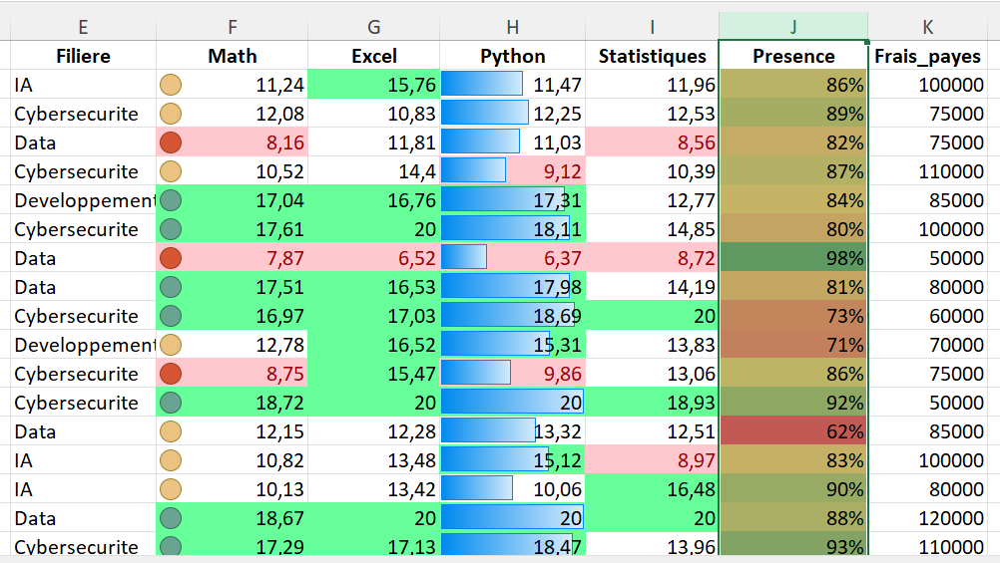

**Test complémentaire** avec un jeu de flèches directionnelles sur la colonne Excel, pour observer comment Excel répartit les trois niveaux :

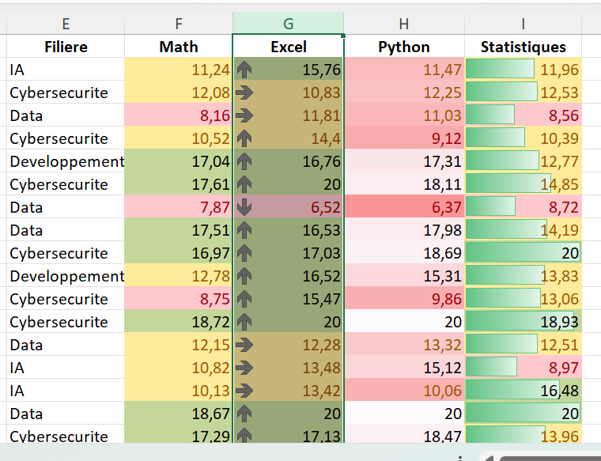

</details>

---

## 🎯 Mini-projet — Suivi visuel des notes

Objectif : réunir les quatre techniques de la journée dans une seule représentation exploitable.

- **Notes** → trois règles de seuil : inférieures à 10, intermédiaires, supérieures ou égales à 15
- **Présence** → échelle de couleurs
- **Une matière** → barres de données
- **Synthèse** → jeu d'icônes

**➊ Notes inférieures à 10**, sur le jeu de données complet


**➋ Notes intermédiaires**, comprises entre 10 et 14,99

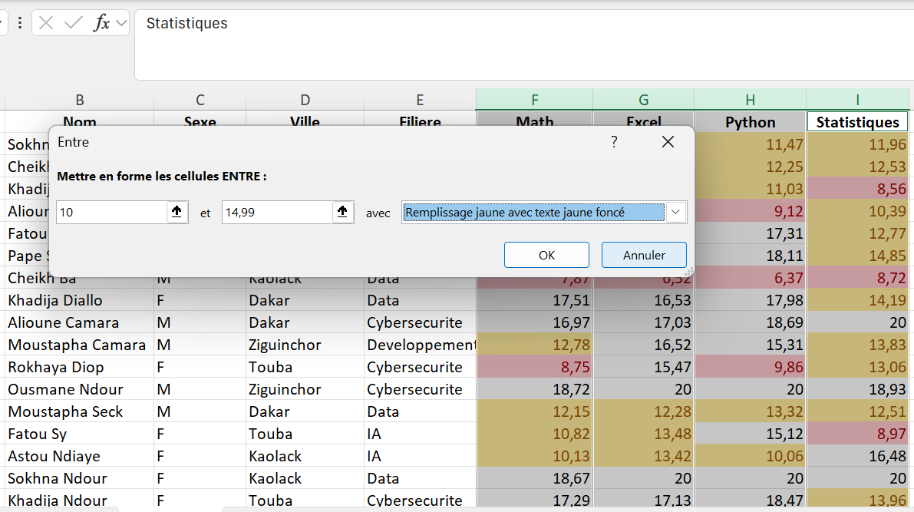

✅ Le mini-projet a été réalisé et testé avec succès : les quatre techniques cohabitent sur le même tableau sans se contredire.

---

## 🧠 Le problème du bruit visuel

Il serait possible d'empiler couleurs, échelles, barres et icônes sur presque toutes les colonnes — mais un tableau saturé de mise en forme n'est pas plus lisible, il l'est souvent moins.

Chaque règle doit répondre à une **question analytique précise** :

| Question                                            | Outil pertinent      |
| :-------------------------------------------------- | :------------------- |
| Quels étudiants ont une note inférieure à 10 ?   | Règle de seuil      |
| Comment se répartissent les niveaux de présence ? | Échelle de couleurs |
| Comment comparer rapidement les notes de Python ?   | Barres de données   |

> 💡 **À retenir :** la mise en forme conditionnelle doit être utilisée comme outil d'analyse, et non uniquement comme élément décoratif.

---

## ⚡ Mémo des outils de mise en forme conditionnelle

| Outil                           | Usage                                                   | Exemple du jour                          |
| :------------------------------ | :------------------------------------------------------ | :--------------------------------------- |
| Règles de mise en surbrillance | Repérer des valeurs selon un seuil (>, <, =, entre)    | Notes < 10, notes ≥ 15                  |
| Nuances de couleurs             | Visualiser une répartition faible → élevée          | Présence                                |
| Barres de données              | Comparer des valeurs par leur longueur                  | Notes de Python                          |
| Jeux d'icônes                  | Lecture synthétique à trois niveaux ou plus           | Performance globale                      |
| Gestionnaire des règles        | Consulter, modifier ou corriger une plage d'application | Correction`=$F:$I` → `=$F$2:$I$101` |

---

## 💡 Points de vigilance retenus

1. **La mise en forme conditionnelle ne modifie jamais la valeur d'une cellule** — seule son apparence change.
2. **Une règle dépend autant de sa plage que de sa condition** — toujours vérifier les deux dans le Gestionnaire des règles.
3. **Un texte ne satisfait pas une condition numérique** — mais une plage mal bornée reste une mauvaise pratique à corriger.
4. **Trop de mise en forme nuit à la lisibilité** — chaque règle doit répondre à une question précise.
5. **Le Gestionnaire des règles est l'outil de diagnostic**, pas seulement de création.

---

## 📁 Contenu du dossier

```text
J05-Mise-en-forme-conditionnelle/
│
├── README.md                    ← ce fichier
│
├── documentation/
│   ├── Jour5_Excel_MiseEnFormeConditionnelle_Ndeye_Penda_SARR.docx
│   └── Jour5_Excel_MiseEnFormeConditionnelle_Ndeye_Penda_SARR.pdf
│
├── exercices/
│   └── Classeur-J05.xlsx
│
└── captures/
    ├── 01-dialogue-nouvelle-regle-superieure-egale-15.png
    ├── ...
    └── 16-dialogue-entre-10-et-15-notes-intermediaires.png
```

---

## ✅ Statut

**Jour 5 terminé et validé.**
Compétence principale acquise : *utiliser la mise en forme conditionnelle comme un premier niveau de data visualisation dans Excel, en la mettant toujours au service d'une question d'analyse précise.*

---

<sub>Ndeye Penda SARR — Apprenante Promotion 8, Développement Data · Orange Digital Center · 2026</sub>
