# 📐 Jour 6 — Opérateurs et calculs

<p>
  
  
  
  
</p>

> **En une phrase :** une formule ne se juge pas au résultat qu'elle affiche aujourd'hui, mais à sa capacité à rester correcte quand les données changeront.

[⬅️ Retour au Sprint 1](../README.md) · [🏠 Sommaire du bootcamp](../../README.md)

---

## 📎 Livrables

| Fichier | Description |
|:---|:---|
| [📕 Rapport complet (PDF)](./documentation/Jour6_Excel_Operateurs_Calculs_Ndeye_Penda_SARR.pdf) | Version illustrée et détaillée, lisible directement dans GitHub |
| [📝 Rapport complet (Word)](./documentation/Jour6_Excel_Operateurs_Calculs_Ndeye_Penda_SARR.docx) | Version éditable du rapport |
| [📊 Classeur Excel](./exercices/Classeur-J06.xlsx) | Les 3 exercices, le calculateur de salaire et le challenge |
| [📸 Captures](./captures/) | 16 preuves visuelles des manipulations |

---

## 🎯 Objectifs de la journée

- Distinguer une valeur d'une formule
- Utiliser les quatre opérateurs arithmétiques `+` `-` `*` `/`
- Calculer un pourcentage et le formater correctement
- Comprendre la priorité des opérations et la contrôler avec des parenthèses
- Construire un calculateur de salaire entièrement basé sur des références de cellules
- Vérifier qu'un modèle se met à jour automatiquement quand les données d'entrée changent

---

## 🧩 La notion clé de la journée

| | Valeur | Formule |
|:---|:---|:---|
| **Contenu** | Une donnée figée | Une expression de calcul |
| **Mise à jour** | Manuelle uniquement | Automatique au recalcul |
| **Dépendance** | Aucune | Liée aux cellules référencées |
| **Usage** | Données d'entrée | Résultats calculés |

⚙️ **La priorité des opérations dans Excel :**

```text
1. Parenthèses ( )
2. Pourcentage %
3. Puissance ^
4. Multiplication * et division /
5. Addition + et soustraction -
```

À rang égal, Excel calcule de gauche à droite.

---

## 🧪 Exercices réalisés

<details>
<summary><strong>Exercice 1 — Les quatre opérations</strong></summary>

Valeurs de départ : `A1 = 100` et `B1 = 20`.

| Opération | Formule | Résultat |
|:---|:---|---:|
| Addition | `=A1+B1` | 120 |
| Soustraction | `=A1-B1` | 80 |
| Multiplication | `=A1*B1` | 2 000 |
| Division | `=A1/B1` | 5 |

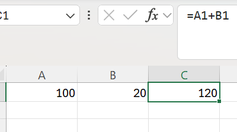
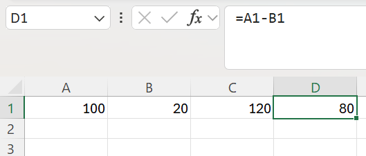
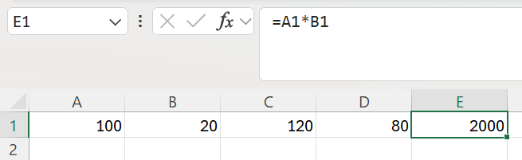
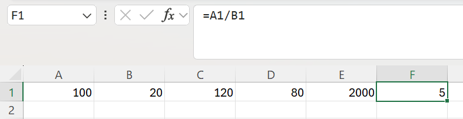

💡 Aucune valeur n'est saisie en dur : chaque formule référence A1 et B1. Modifier A1 met donc à jour les quatre résultats d'un coup.
</details>

<details>
<summary><strong>Exercice 2 — Calculer un pourcentage</strong></summary>

Salaire brut 250 000, retenue 25 000. La formule est simplement `Partie / Total` :

```excel
=25000/250000     →  0,10     →  10 % après application du format Pourcentage
```

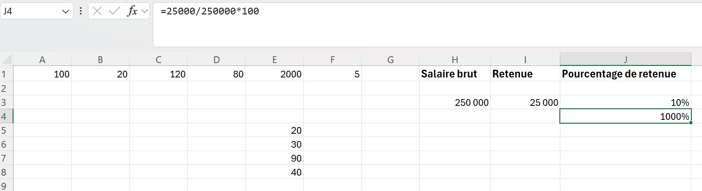

⚠️ **Le piège vérifié en pratique :** si la cellule porte déjà le format Pourcentage, il ne faut **pas** multiplier par 100.

| Formule | Valeur calculée | Affichage en format % |
|:---|:---|:---|
| `=25000/250000` | 0,10 | **10 %** ✅ |
| `=25000/250000*100` | 10 | **1000 %** ❌ |

La multiplication par 100 et le format pourcentage font le même travail : les cumuler double l'opération.
</details>

<details>
<summary><strong>Exercice 3 — La priorité des opérations</strong></summary>

| Formule | Ordre appliqué par Excel | Résultat |
|:---|:---|---:|
| `=10+5*2` | 5 × 2 = 10, puis 10 + 10 | 20 |
| `=(10+5)*2` | 10 + 5 = 15, puis 15 × 2 | 30 |
| `=100-20/2` | 20 ÷ 2 = 10, puis 100 − 10 | 90 |
| `=(100-20)/2` | 100 − 20 = 80, puis 80 ÷ 2 | 40 |

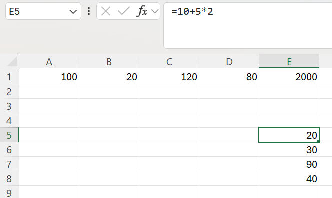
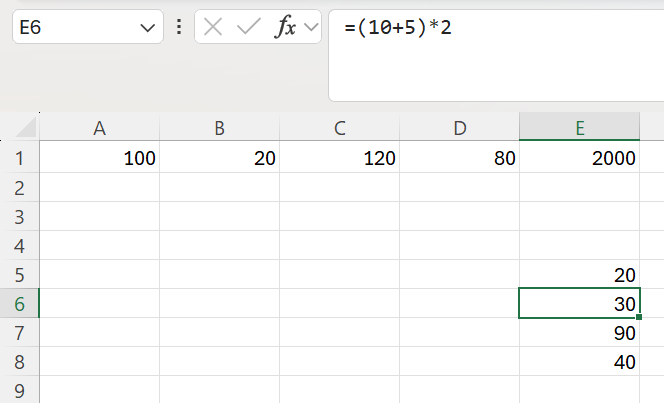
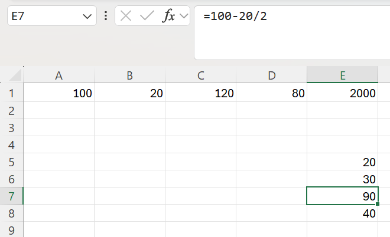
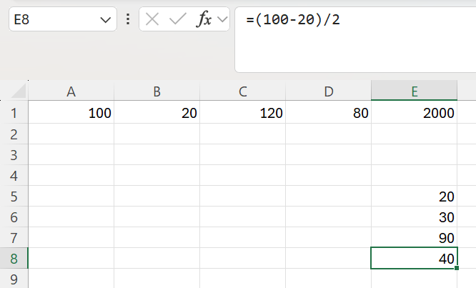

🔍 Mêmes nombres, mêmes opérateurs, résultats différents. Seules les parenthèses changent — elles ne sont pas décoratives.
</details>

---

## 💼 Mini-projet — Calculateur de salaire

### Données d'entrée

| Élément | Valeur |
|:---|---:|
| Salaire de base | 250 000 |
| Prime de transport | 30 000 |
| Prime de performance | 10 % |
| Heures supplémentaires | 20 |
| Taux horaire | 2 500 |
| Taux de retenue | 5 % |

### Les cinq étapes de calcul

<details>
<summary><strong>Étape 1 — Prime de performance</strong></summary>

```excel
=B1*B3          →  250 000 × 10 %  =  25 000
```

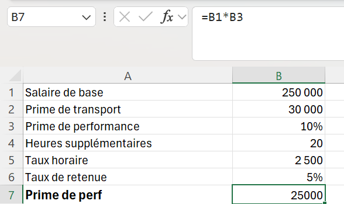

⚠️ Le taux étant stocké comme `0,1` et affiché `10 %`, il ne faut **pas** diviser par 100. `=B1*B3/100` donnerait 250 FCFA au lieu de 25 000.
</details>

<details>
<summary><strong>Étape 2 — Heures supplémentaires</strong></summary>

```excel
=B4*B5          →  20 × 2 500  =  50 000
```

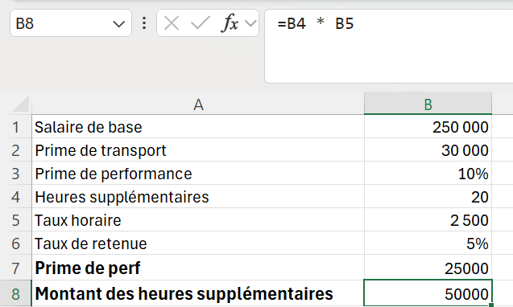
</details>

<details>
<summary><strong>Étape 3 — Salaire brut</strong></summary>

```excel
=B1+B2+B7+B8    →  250 000 + 30 000 + 25 000 + 50 000  =  355 000
```

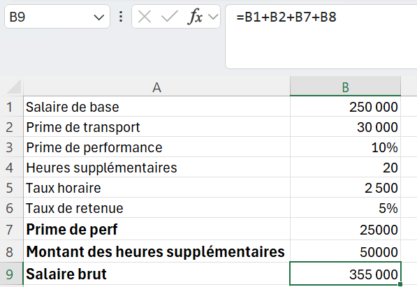

🔗 Les deux derniers termes sont eux-mêmes des résultats de calcul : le modèle s'enchaîne.
</details>

<details>
<summary><strong>Étape 4 — Retenue</strong></summary>

```excel
=B9*B6          →  355 000 × 5 %  =  17 750
```

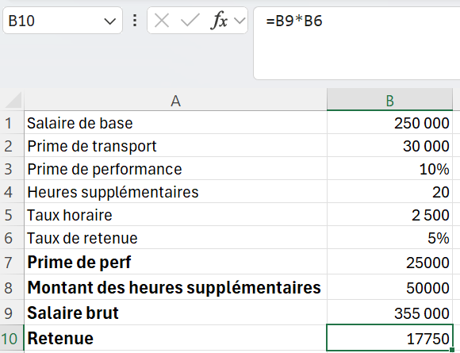

La retenue porte sur le salaire **brut calculé**, pas sur le salaire de base.
</details>

<details>
<summary><strong>Étape 5 — Salaire net</strong></summary>

```excel
=B9-B10         →  355 000 − 17 750  =  337 250
```

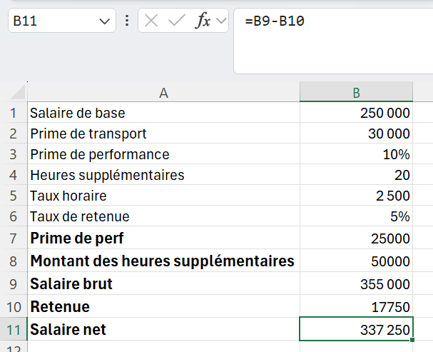
</details>

### Résultat final

| Calcul | Résultat | Origine |
|:---|---:|:---|
| Salaire de base | 250 000 FCFA | Donnée d'entrée |
| Prime de transport | 30 000 FCFA | Donnée d'entrée |
| Prime de performance | 25 000 FCFA | Calculé — 10 % du base |
| Heures supplémentaires | 50 000 FCFA | Calculé — 20 × 2 500 |
| **Salaire brut** | **355 000 FCFA** | Somme des quatre lignes |
| Retenue 5 % | 17 750 FCFA | Calculé — 5 % du brut |
| **Salaire net** | **337 250 FCFA** | Brut moins retenue |

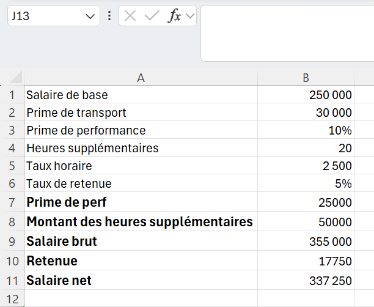

---

## 🏆 Challenge — Vérifier le caractère dynamique

Trois données d'entrée ont été modifiées : salaire de base porté à **500 000**, heures supplémentaires à **25**, taux de retenue à **8 %**.

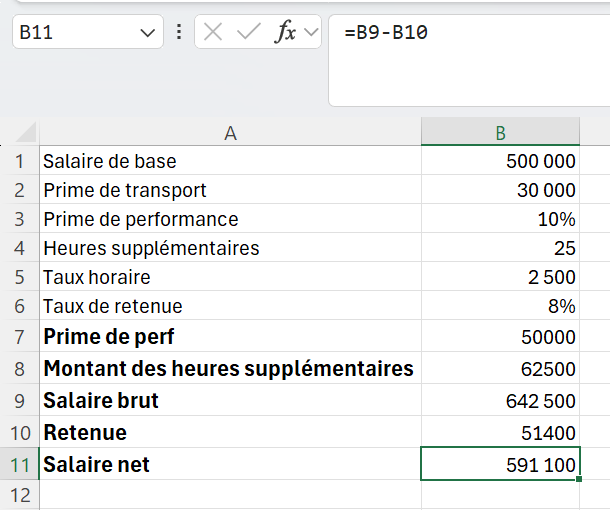

Les sept lignes de résultat se sont recalculées seules :

| | Avant | Après |
|:---|---:|---:|
| Salaire brut | 355 000 | **642 500** |
| Retenue | 17 750 | **51 400** |
| Salaire net | 337 250 | **591 100** |

✅ Le calculateur n'est pas un tableau de résultats figés, c'est un **modèle**. La différence tient entièrement à un choix d'écriture : avoir référencé les cellules plutôt que saisi les nombres dans les formules.

---

## ⚡ Mémo

| Élément | Rôle | Remarque |
|:---|:---|:---|
| `+ - * /` | Les quatre opérations | `×` et `÷` ne sont pas reconnus |
| `^` | Puissance | `=2^3` donne 8 |
| `( )` | Forcer l'ordre du calcul | Priorité maximale |
| `%` | Diviser par 100 | `=50%` vaut 0,5 |
| `F2` | Passer en mode édition | Affiche les cellules référencées |
| `F9` sur une sélection | Évaluer une portion de formule | `Échap` ensuite pour ne pas figer |
| `#DIV/0!` | Division par zéro | Dénominateur nul ou cellule vide |

---

## 💡 Ce que j'ai retenu

Un modèle se construit en trois zones : **les données d'entrée**, **les calculs intermédiaires**, **les résultats**. Chaque calcul référence les cellules précédentes au lieu de répéter des nombres.

> Le test est simple : changer une donnée d'entrée et regarder si tout suit. Si les résultats ne bougent pas, ce n'est pas un modèle — c'est une photographie.

🔭 **Piste identifiée pour la suite :** Excel permet de nommer les cellules (Formules › Définir un nom). La formule devient alors `=Salaire_brut-Retenue` au lieu de `=B9-B10`. Le calcul est identique, mais la formule se relit sans avoir à retrouver le contenu de chaque cellule.

---

## 📁 Contenu du dossier

```text
J06-Operateurs-et-calculs/
│
├── README.md                    ← ce fichier
│
├── documentation/
│   ├── Jour6_Excel_Operateurs_Calculs_Ndeye_Penda_SARR.docx
│   └── Jour6_Excel_Operateurs_Calculs_Ndeye_Penda_SARR.pdf
│
├── exercices/
│   └── Classeur-J06.xlsx
│
└── captures/
    ├── 01-addition-a1-plus-b1.png
    ├── ...
    └── 16-challenge-donnees-modifiees.png
```

---

## ✅ Statut

**Jour 6 terminé et validé.**
Compétence principale acquise : *construire des calculs corrects et dynamiques à partir de références de cellules, en maîtrisant les opérateurs, les pourcentages et la priorité des opérations.*

---

<sub>Ndeye Penda SARR — Apprenante Promotion 8, Développement Data · Orange Digital Center · 2026</sub>
