# 📊 Jour 7 — Fonctions statistiques essentielles

<p>
  
  
  
  
</p>

> **En une phrase :** jusqu'ici Excel répondait à « combien font ces nombres ? ». À partir d'aujourd'hui, il répond à « combien d'étudiants sont dans cette situation ? ».

[⬅️ Retour au Sprint 1](../README.md) · [🏠 Sommaire du bootcamp](../../README.md)

---

## 📎 Livrables

| Fichier | Description |
|:---|:---|
| [📕 Rapport complet (PDF)](./documentation/Jour7_Excel_Fonctions_Statistiques_Ndeye_Penda_SARR.pdf) | Version illustrée et détaillée, lisible directement dans GitHub |
| [📝 Rapport complet (Word)](./documentation/Jour7_Excel_Fonctions_Statistiques_Ndeye_Penda_SARR.docx) | Version éditable du rapport |
| [📊 Classeur Excel](./exercices/Classeur-J07.xlsx) | Les 3 exercices, la feuille Analyse_Notes et le challenge |
| [📸 Captures](./captures/) | 15 preuves visuelles des manipulations |

---

## 🎯 Objectifs de la journée

Découvrir les fonctions statistiques essentielles et commencer à utiliser Excel comme un outil d'**analyse**, sur le dataset des 1 000 étudiants déjà exploité au Jour 3.

| Fonction | Équivalent français | Rôle |
|:---|:---|:---|
| `SUM` | `SOMME` | Additionner les valeurs d'une plage |
| `AVERAGE` | `MOYENNE` | Calculer la moyenne |
| `MAX` | `MAX` | Trouver la valeur la plus élevée |
| `MIN` | `MIN` | Trouver la valeur la plus basse |
| `COUNT` | `NB` | Compter les valeurs numériques |
| `COUNTIF` | `NB.SI` | Compter selon un critère |
| `COUNTIFS` | `NB.SI.ENS` | Compter selon plusieurs critères |

🌐 L'interface Excel a été basculée en anglais pour cette journée afin d'utiliser directement les noms du support. Le séparateur reste le **point-virgule** : il dépend des paramètres régionaux de Windows, pas de la langue d'Excel.

---

## 🧩 La notion clé : formule ou fonction ?

Une **formule** est une expression que je construis moi-même. Une **fonction** est une formule prédéfinie par Excel, avec un nom et des arguments.

```excel
=A1+B1              ← une formule
=SUM(A1:A10)        ← une fonction
```

Toute fonction est une formule, mais toute formule n'est pas une fonction.

---

## 🧪 Exercices réalisés

<details>
<summary><strong>Exercice 1 — Statistiques descriptives sur la colonne Python</strong></summary>

| Indicateur | Formule | Résultat |
|:---|:---|---:|
| Somme des notes | `=SUM(H2:H1001)` | 13 431,18 |
| Moyenne | `=AVERAGE(H2:H1001)` | 13,43 |
| Note maximale | `=MAX(H2:H1001)` | 20 |
| Note minimale | `=MIN(H2:H1001)` | 0,41 |
| Nombre de notes | `=COUNT(H2:H1001)` | 1 000 |

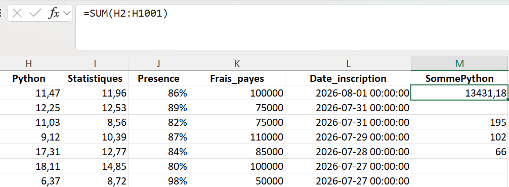
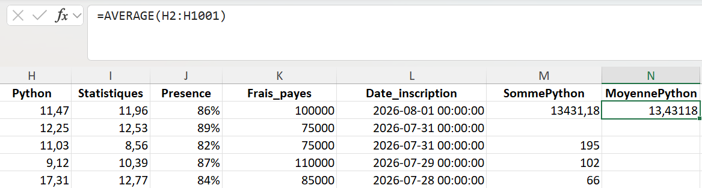
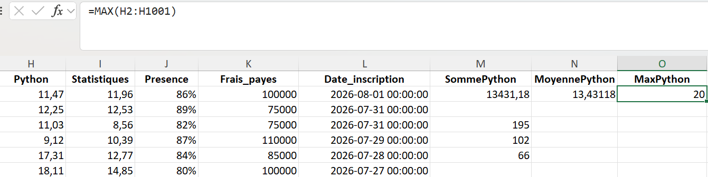
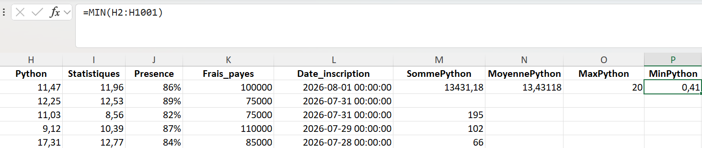
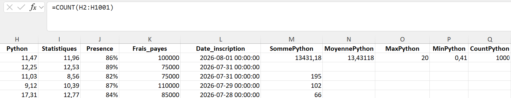

⚠️ **Le piège de COUNT :** il ne compte pas « le nombre de personnes » mais les **valeurs numériques**. Une colonne contenant du texte, des identifiants ou des cellules vides donnerait un résultat différent.

| Fonction | Français | Ce qu'elle compte |
|:---|:---|:---|
| `COUNT` | `NB` | Les cellules numériques uniquement |
| `COUNTA` | `NBVAL` | Toutes les cellules non vides |
| `COUNTBLANK` | `NB.VIDE` | Les cellules vides |

✅ **Vérification gratuite :** somme ÷ COUNT doit redonner exactement la moyenne. Ici 13 431,18 ÷ 1 000 = 13,43 — les plages sont bien cohérentes.
</details>

<details>
<summary><strong>Exercice 2 — Compter selon une condition avec COUNTIF</strong></summary>

| Question | Formule | Résultat |
|:---|:---|---:|
| Combien ont Python ≥ 15 ? | `=COUNTIF(H2:H1001;">=15")` | **342** |
| Combien ont Math < 10 ? | `=COUNTIF(F2:F1001;"<10")` | **192** |
| Combien ont Présence ≥ 90 % ? | `=COUNTIF(J2:J1001;">=90%")` | **306** |

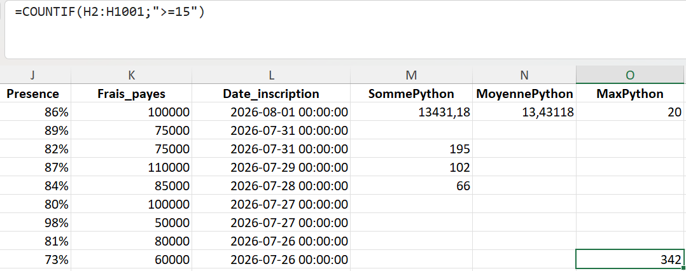
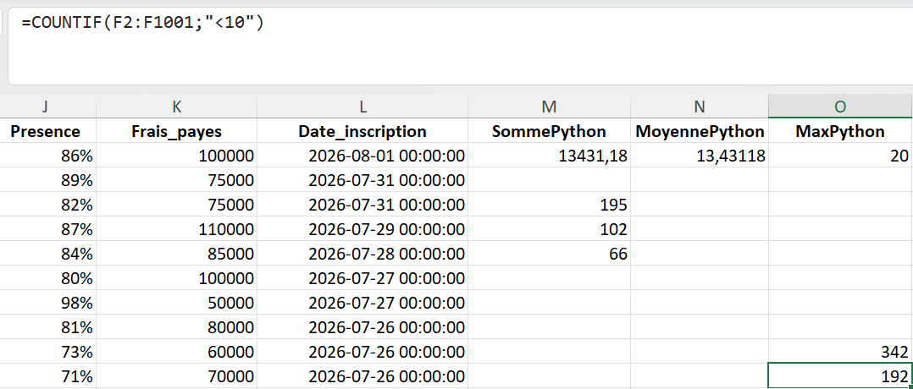
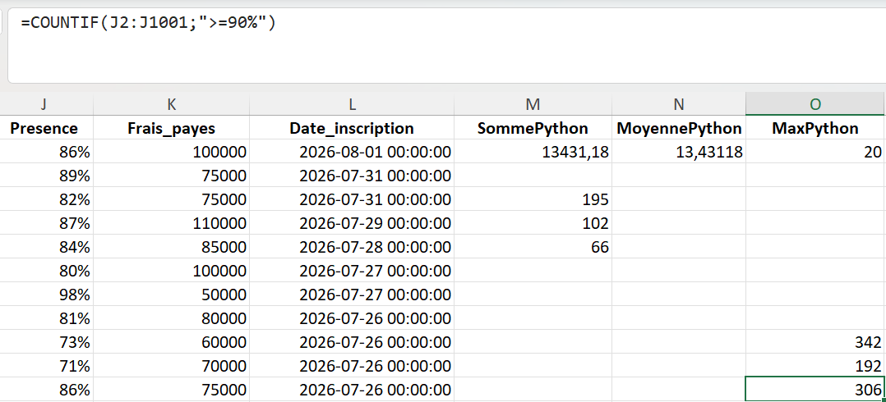

💡 Le critère `">=90%"` fonctionne parce que la présence est stockée comme un nombre décimal : `0,9` affiché `90 %`. C'est la distinction valeur / affichage du Jour 2 qui rend le comptage possible.

**La syntaxe des critères :**

| Écriture | Signification | Remarque |
|:---|:---|:---|
| `">=15"` | Au moins 15 | Toujours entre guillemets |
| `"<10"` | Moins de 10 | L'opérateur est dans le texte |
| `"Data"` | Égal au texte Data | L'égalité n'a pas besoin de signe |
| `">="&B1` | Au moins la valeur de B1 | Le `&` relie l'opérateur à la référence |

La dernière écriture est la plus professionnelle : le seuil vit dans une cellule au lieu d'être figé dans la formule.
</details>

<details>
<summary><strong>Exercice 3 — Compter avec plusieurs conditions avec COUNTIFS</strong></summary>

| Cas | Conditions | Résultat |
|:---|:---|---:|
| Cas 1 | Python ≥ 15 **ET** Math ≥ 15 | **195** |
| Cas 2 | Python ≥ 15 **ET** Présence ≥ 90 % | **102** |
| Cas 3 | Math < 10 **ET** Présence < 80 % | **66** |

```excel
=COUNTIFS(H2:H1001;">=15";F2:F1001;">=15")
=COUNTIFS(H2:H1001;">=15";J2:J1001;">=90%")
=COUNTIFS(F2:F1001;"<10";J2:J1001;"<80%")
```

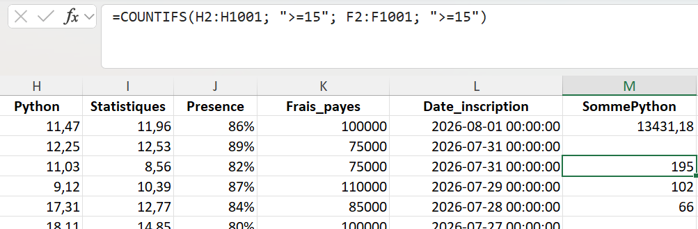
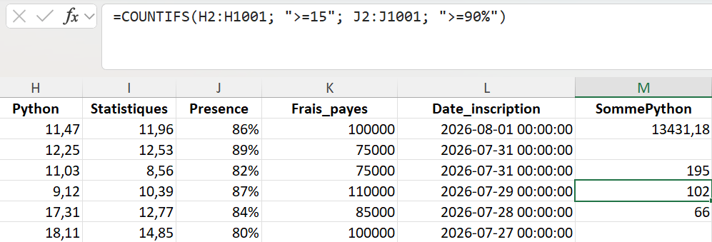
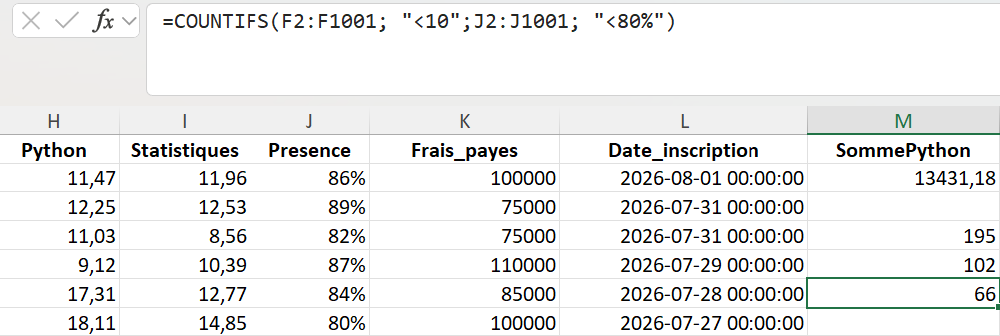

🔑 **COUNTIFS ne sait faire que du ET.** Les plages doivent être de même dimension, sinon Excel renvoie `#VALUE!`. Il n'existe pas de fonction native pour compter avec un OU — c'est exactement l'objet du challenge.
</details>

---

## 🎯 Mini-projet — Analyse des notes d'une promotion

Feuille `Analyse_Notes`, destinée à un responsable pédagogique, organisée en trois tableaux.

### Tableau 1 — Résumé général

| Indicateur | Math | Python |
|:---|---:|---:|
| Nombre de notes | 1 000 | 1 000 |
| Moyenne | 13,19 | 13,43 |
| Note maximale | 20 | 20 |
| Note minimale | 3,30 | 0,41 |

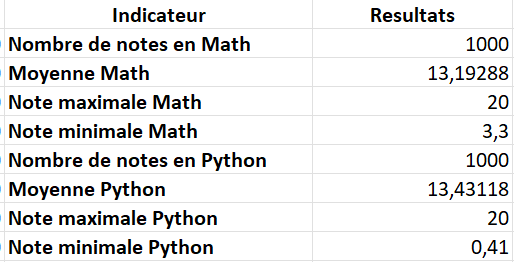

📉 Les deux moyennes sont proches, mais les minima non : 3,30 en Math contre 0,41 en Python. La dispersion est plus forte en Python — la moyenne seule aurait masqué cette différence.

### Tableau 2 — Les bonnes performances

| Indicateur | Effectif | Part de la promotion |
|:---|---:|---:|
| Étudiants avec Python ≥ 15 | 342 | 34,2 % |
| Étudiants avec Math ≥ 15 | 322 | 32,2 % |
| Étudiants avec Présence ≥ 90 % | 306 | 30,6 % |

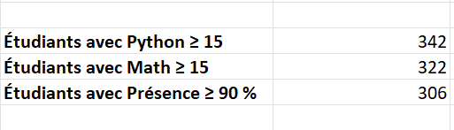

### Tableau 3 — Les profils

| Profil | Conditions | Effectif | Lecture |
|:---|:---|---:|:---|
| Profil performant | Math ≥ 15 ET Python ≥ 15 | **195** | Solide dans les deux matières |
| Bon niveau et assiduité | Python ≥ 15 ET Présence ≥ 90 % | **102** | Résultats confirmés par la présence |
| Situation à surveiller | Math < 10 ET Présence < 80 % | **66** | Décrochage possible |

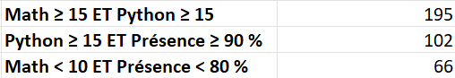

🔍 Le troisième profil est le plus utile des trois. Un étudiant faible en Math peut avoir plusieurs explications ; un étudiant faible **et** peu présent en a probablement une seule. Croiser deux critères ne donne pas seulement un chiffre, cela donne une piste d'action.

---

## 🏆 Challenge — Math ≥ 15 **OU** Python ≥ 15

`COUNTIFS` combine avec ET. La question demande un OU. Additionner les deux comptages ne suffit pas : les étudiants forts dans les deux matières seraient comptés deux fois.

```text
  Math ≥ 15                        →  322
+ Python ≥ 15                      →  342
− (Math ≥ 15 ET Python ≥ 15)       →  195
─────────────────────────────────────────
= 469 étudiants
```

```excel
=COUNTIF(F2:F1001;">=15")+COUNTIF(H2:H1001;">=15")-COUNTIFS(F2:F1001;">=15";H2:H1001;">=15")
```

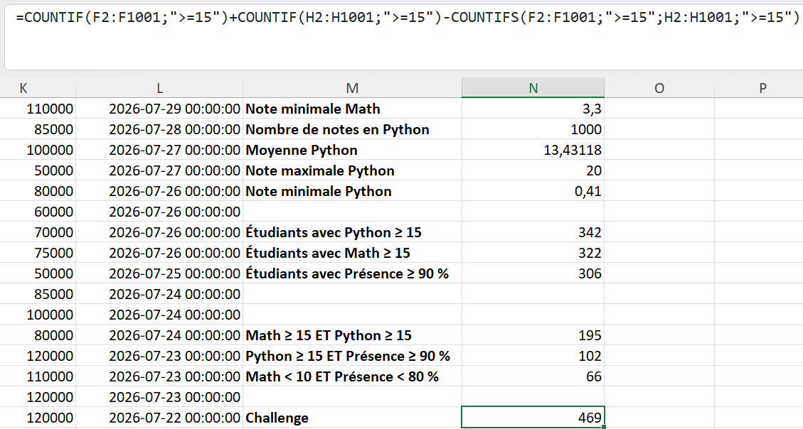

📐 Ce raisonnement porte un nom : le **principe d'inclusion-exclusion**. Il se retrouve partout en analyse de données, dès qu'on compte des populations qui se recouvrent — des clients présents dans plusieurs segments, par exemple.

**Ce que le challenge m'a appris :** une question d'analyse se traduit d'abord en logique, ensuite seulement en fonctions.

```text
Question métier  →  Logique  →  Critères  →  Fonctions Excel  →  Résultat
```

---

## ⚡ Mémo des erreurs fréquentes

| Message | Cause probable |
|:---|:---|
| `#NAME?` | Fonction mal orthographiée, ou nom français sur une interface anglaise |
| `#VALUE!` | Plages de tailles différentes dans `COUNTIFS` |
| `#DIV/0!` | Moyenne calculée sur une plage sans valeur numérique |
| Résultat `0` | Critère mal écrit, le plus souvent des guillemets manquants |

---

## 💡 Ce que j'ai retenu

Ces comptages préfigurent directement les **tableaux croisés dynamiques** et les **mesures DAX** de Power Pivot, étudiés plus loin dans le bootcamp. Un `COUNTIFS` n'est rien d'autre qu'un comptage filtré — ce qu'un tableau croisé fait en automatique, sur toutes les combinaisons à la fois.

> Une fonction Excel n'est pas une syntaxe à mémoriser. Quand elle ne répond pas directement, ce n'est pas une impasse : c'est le signal qu'il faut décomposer la question.

---

## 📁 Contenu du dossier

```text
J07-Fonctions-statistiques/
│
├── README.md                    ← ce fichier
│
├── documentation/
│   ├── Jour7_Excel_Fonctions_Statistiques_Ndeye_Penda_SARR.docx
│   └── Jour7_Excel_Fonctions_Statistiques_Ndeye_Penda_SARR.pdf
│
├── exercices/
│   └── Classeur-J07.xlsx
│
└── captures/
    ├── 01-sum-somme-notes-python.png
    ├── ...
    └── 15-challenge-formule-ou.png
```

---

## ✅ Statut

**Jour 7 terminé et validé.**
Compétence principale acquise : *résumer et interroger un jeu de données à l'aide des fonctions statistiques essentielles, et traduire une question d'analyse en critères de comptage.*

---

<sub>Ndeye Penda SARR — Apprenante Promotion 8, Développement Data · Orange Digital Center · 2026</sub>
