# 🧠 Jour 8 — Fonctions logiques

<p>
  
  
  
  
</p>

> **En une phrase :** le Jour 7 comptait des situations, le Jour 8 les qualifie. Excel passe de « combien d'étudiants sont dans ce cas ? » à « que faut-il décider pour cet étudiant ? ».

[⬅️ Retour au Sprint 1](../README.md) · [🏠 Sommaire du bootcamp](../../README.md)

---

## 📎 Livrables

| Fichier | Description |
|:---|:---|
| [📕 Rapport complet (PDF)](./documentation/Jour8_Excel_Fonctions_Logiques_Ndeye_Penda_SARR.pdf) | Version illustrée et détaillée, lisible directement dans GitHub |
| [📝 Rapport complet (Word)](./documentation/Jour8_Excel_Fonctions_Logiques_Ndeye_Penda_SARR.docx) | Version éditable du rapport |
| [📊 Classeur Excel](./exercices/Classeur-J08.xlsx) | Les 6 exercices et le système d'admission |
| [📸 Captures](./captures/) | 12 preuves visuelles des manipulations |

---

## 🎯 Les six fonctions étudiées

| Fonction | Équivalent français | Rôle |
|:---|:---|:---|
| `IF` | `SI` | Choisir entre deux résultats selon une condition |
| `AND` | `ET` | Vrai si **toutes** les conditions sont vraies |
| `OR` | `OU` | Vrai si **au moins une** condition est vraie |
| `NOT` | `NON` | Inverser une condition |
| `IFS` | `SI.CONDITIONS` | Tester plusieurs conditions successives |
| `IFERROR` | `SIERREUR` | Définir l'affichage en cas d'erreur |

---

## 🧩 La notion clé : AND ou OR ?

| | `AND` (ET) | `OR` (OU) |
|:---|:---|:---|
| **Règle** | Toutes les conditions doivent être vraies | Une seule suffit |
| **Effet** | Restreint la population | Élargit la population |
| **Usage type** | Critères d'éligibilité | Systèmes d'alerte |

⚠️ Le choix n'est pas une question de syntaxe mais de **sens métier**. Une admission exige que tout soit réuni : c'est un `AND`. Une alerte doit se déclencher au moindre signal : c'est un `OR`.

> Confondre les deux ne produit pas une erreur — cela produit un résultat **faux et parfaitement plausible**. C'est le risque principal de la journée.

---

## 🧪 Exercices réalisés

<details>
<summary><strong>Exercice 1 — IF : la décision simple</strong></summary>

```excel
=IF(H2>=10;"Admis";"Non admis")
```

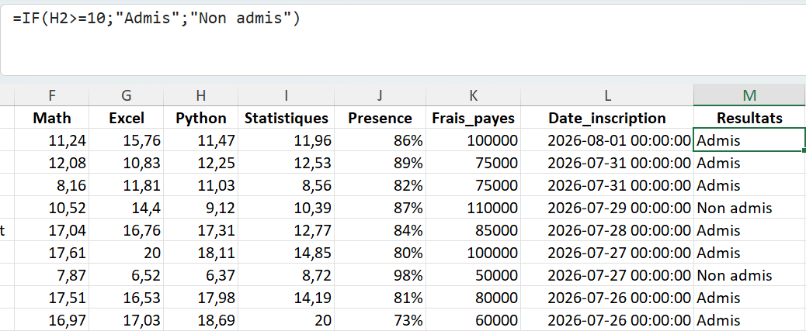

La règle n'est écrite qu'une fois, puis s'applique aux 1 000 étudiants par recopie.
</details>

<details>
<summary><strong>Exercice 2 — IF + AND : le critère d'éligibilité</strong></summary>

Trois conditions à réunir : Math ≥ 12, Python ≥ 12 **et** Présence ≥ 80 %.

```excel
=IF(AND(F2>=12;H2>=12;J2>=80%);"Eligible";"Non eligible")
```

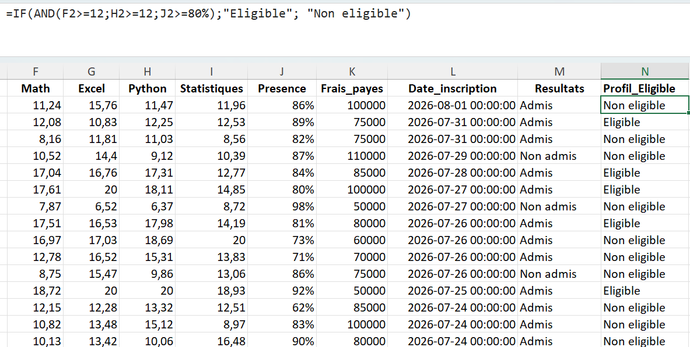

`AND` réduit trois conditions à une seule réponse vraie ou fausse, que `IF` transforme ensuite en texte lisible.
</details>

<details>
<summary><strong>Exercice 3 — IF + OR : le système d'alerte</strong></summary>

```excel
=IF(OR(F2<10;H2<10);"A surveiller";"RAS")
```

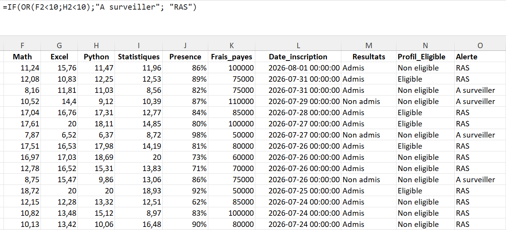

Logique exactement inverse de l'exercice précédent : utiliser `AND` ici ne signalerait que les étudiants faibles dans **les deux** matières, et laisserait passer ceux qui décrochent dans une seule.
</details>

<details>
<summary><strong>Exercice 4 — NOT : inverser une condition</strong></summary>

```excel
=IF(NOT(E2="Data");"Hors Data";"Data")
```

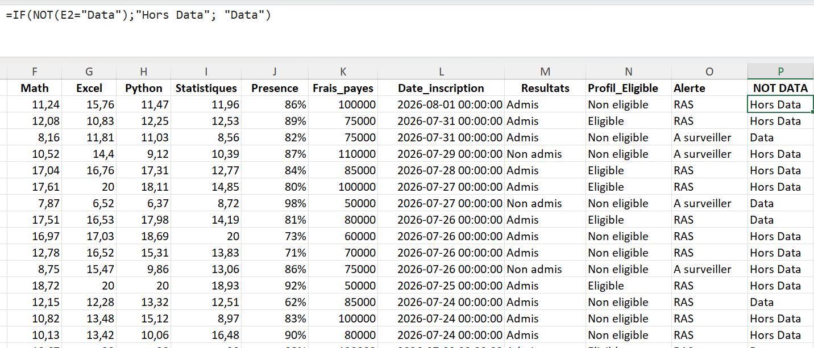

💡 `E2<>"Data"` donnerait le même résultat. `NOT` prend l'avantage quand la condition à inverser est elle-même complexe : `NOT(AND(...))` se relit mieux qu'une réécriture manuelle.
</details>

<details>
<summary><strong>Exercice 5 — IFS : attribuer un niveau</strong></summary>

```excel
=IFS(H2>=16;"Excellent";H2>=14;"Très Bien";H2>=12;"Bien";H2>=10;"Passable";TRUE;"Insuffisant")
```

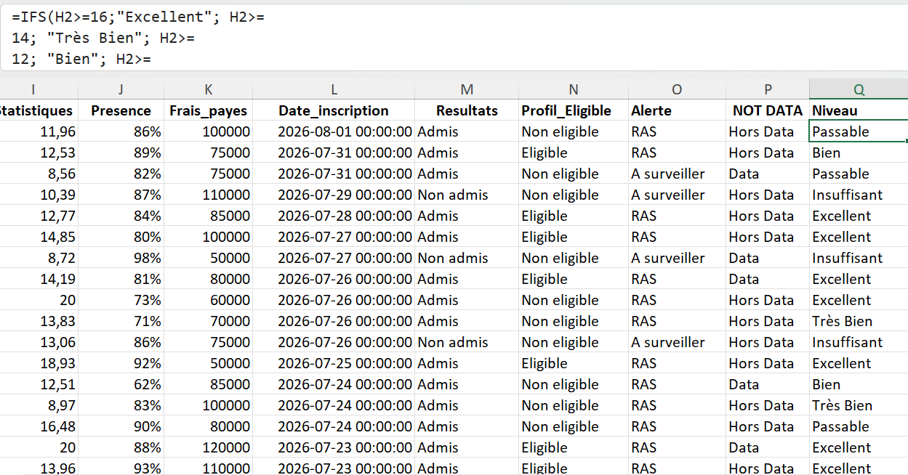

⚠️ **L'ordre est déterminant.** `IFS` s'arrête à la première condition vraie : une note de 18 satisfait aussi bien `≥16` que `≥10`. Écrits du plus bas au plus haut, les seuils attribueraient « Passable » à toute la promotion.

💡 `IFS` n'a **pas de clause « sinon »**. Le `TRUE;"Insuffisant"` final joue ce rôle : toujours vrai, il capte tous les cas restants. Sans lui, une valeur imprévue renvoie `#N/A`.
</details>

<details>
<summary><strong>Exercice 6 — IFERROR : gérer les erreurs</strong></summary>

Une division par zéro sur la troisième ligne provoque l'erreur :

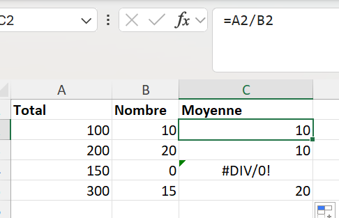

```excel
=IFERROR(A2/B2;"Non disponible")
```

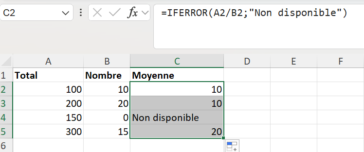

| Démarche | Ce qu'elle fait | Ce qu'elle ne fait pas |
|:---|:---|:---|
| Corriger l'erreur | Identifier pourquoi `Nombre = 0` et traiter la cause | — |
| Masquer avec `IFERROR` | Remplacer l'affichage par une valeur alternative | Corriger la donnée |

⚠️ `IFERROR` intercepte **toutes** les erreurs, y compris `#NAME?` provoquée par une faute de frappe. Un tableau entièrement enveloppé d'IFERROR peut dissimuler un bug tout en paraissant parfaitement propre. `IFNA` est plus ciblé.
</details>

---

## 🎓 Mini-projet — Système d'admission

Feuille `Systeme_Admission` : les données d'origine sont conservées, les décisions ajoutées à côté.

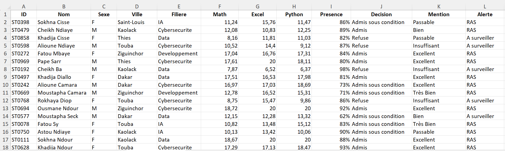

### Étape 1 — La décision d'admission

| Décision | Conditions |
|:---|:---|
| **Admis** | Math ≥ 12 ET Python ≥ 12 ET Presence ≥ 80 % |
| **Admis sous condition** | Math ≥ 10 ET Python ≥ 10, sans remplir les conditions ci-dessus |
| **Refusé** | Tous les autres cas |

```excel
=IFS(AND(F2>=12;H2>=12;I2>=80%);"Admis";
     AND(F2>=10;H2>=10);"Admis sous condition";
     TRUE;"Refuse")
```

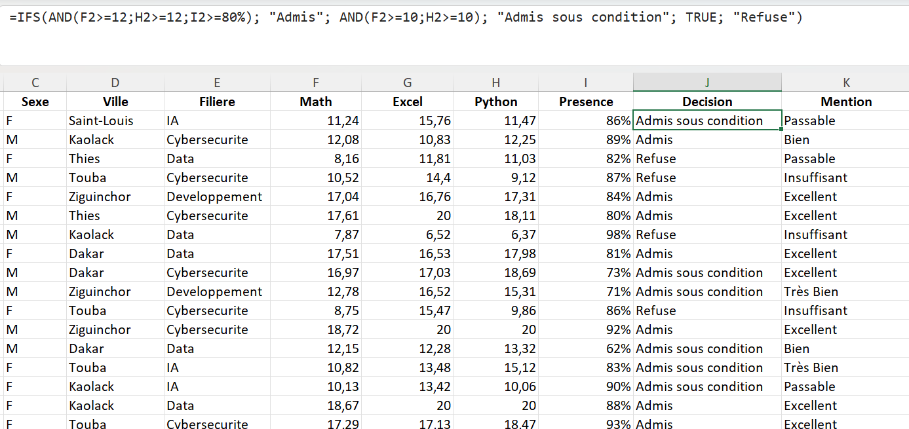

🔑 **Le choix d'`IFS` plutôt que de `IF` imbriqués est le bon.** `IFS` s'arrêtant à la première condition vraie, un étudiant admis directement ne peut pas être requalifié en admission conditionnelle : l'ordre des lignes porte à lui seul la clause « sans remplir les conditions d'admission directe ». Trois `IF` imbriqués auraient donné le même résultat, en moins lisible.

### Étape 2 — La mention

```excel
=IFS(H2>=16;"Excellent";H2>=14;"Très Bien";H2>=12;"Bien";H2>=10;"Passable";TRUE;"Insuffisant")
```

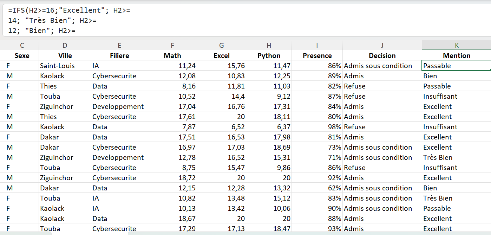

### Étape 3 — L'alerte

```excel
=IF(OR(F2<10;H2<10;I2<70%);"A surveiller";"RAS")
```

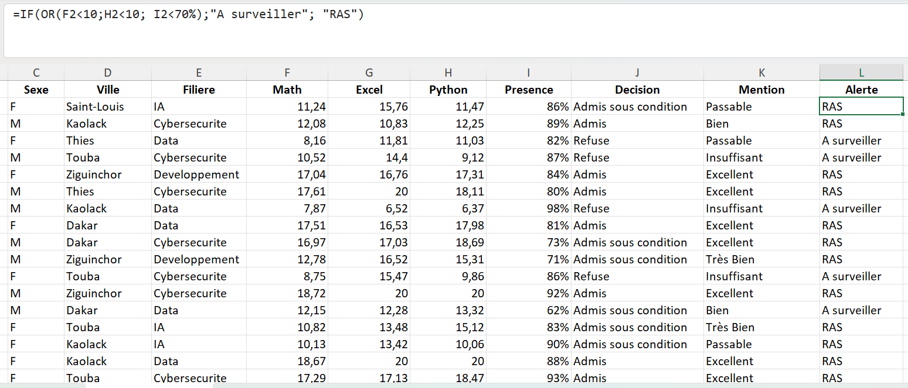

📌 Le seuil de présence retenu ici est **70 %**, plus bas que les 80 % de l'admission. L'alerte ne signale donc pas l'absence d'excellence, mais un risque réel de décrochage.

### Étape 4 — Le statut de filière

```excel
=IF(NOT(E2="Data");"Autre filière";"Data")
```

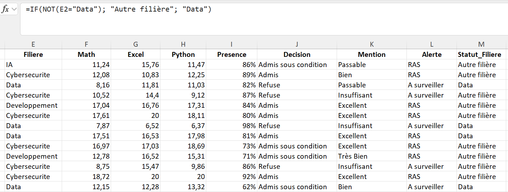

### Le résultat

```text
Données étudiant  →  Formules  →  Decision + Mention + Alerte + Statut_Filiere
```

Aucune de ces quatre informations n'est saisie : toutes sont déduites des notes et de la présence, sur les 1 000 lignes.

---

## 💡 Ce que j'ai retenu

La démarche qui compte n'est pas la syntaxe, c'est la traduction :

```text
Règle métier
      ↓
Traduction en logique   (SI ... ET ... OU ... SINON)
      ↓
Choix des fonctions
      ↓
Formule Excel
```

> Une règle mal formulée produit une formule parfaitement fonctionnelle et parfaitement fausse.

🔭 Cette logique se retrouvera presque à l'identique en **Power Query** (colonnes conditionnelles) puis en **DAX** avec `IF` et `SWITCH`. La syntaxe changera ; le raisonnement construit ici restera le même.

---

## ⚡ Mémo

| Symptôme | Cause probable |
|:---|:---|
| `#N/A` | `IFS` sans condition par défaut, aucune condition satisfaite |
| `#VALUE!` | Comparaison entre un texte et un nombre |
| `#NAME?` | Fonction mal orthographiée ou dans l'autre langue |
| Résultat inattendu | `AND` à la place de `OR`, ou seuils `IFS` dans le mauvais ordre |

---

## ✅ Statut

**Jour 8 terminé et validé.**
Compétence principale acquise : *traduire une règle métier en logique conditionnelle et l'automatiser sur un dataset complet avec IF, AND, OR, NOT, IFS et IFERROR.*

---

<sub>Ndeye Penda SARR — Apprenante Promotion 8, Développement Data · Orange Digital Center · 2026</sub>
