# ✂️ Jour 9 — Fonctions de texte

<p>
  
  
  
  
</p>

> **En une phrase :** premier jour où le travail consiste à **réparer** la donnée avant de pouvoir s'en servir — la réalité de la grande majorité des fichiers reçus.

[⬅️ Retour au Sprint 1](../README.md) · [🏠 Sommaire du bootcamp](../../README.md)

---

## 📎 Livrables

| Fichier | Description |
|:---|:---|
| [📕 Rapport complet (PDF)](./documentation/Jour9_Excel_Fonctions_Texte_Ndeye_Penda_SARR.pdf) | Version illustrée et détaillée, lisible directement dans GitHub |
| [📝 Rapport complet (Word)](./documentation/Jour9_Excel_Fonctions_Texte_Ndeye_Penda_SARR.docx) | Version éditable du rapport |
| [📊 Classeur Excel](./exercices/Classeur-J09.xlsx) | Les 7 exercices, le nettoyage de la base clients et le challenge |
| [📸 Captures](./captures/) | 16 preuves visuelles des manipulations |

---

## 🎯 Les fonctions étudiées

| Fonction | Équivalent français | Rôle |
|:---|:---|:---|
| `LEFT` | `GAUCHE` | Extraire depuis le début |
| `RIGHT` | `DROITE` | Extraire depuis la fin |
| `MID` | `STXT` | Extraire à partir d'une position |
| `LEN` | `NBCAR` | Compter les caractères |
| `TRIM` | `SUPPRESPACE` | Nettoyer les espaces inutiles |
| `CONCAT` | `CONCAT` | Assembler plusieurs textes |
| `TEXTJOIN` | `JOINDRE.TEXTE` | Assembler avec un séparateur |

---

## 🧩 La notion clé : où chaque fonction découpe

```text
C  L  I  -  2  0  2  6  -  0  0  0  1
1  2  3  4  5  6  7  8  9 10 11 12 13
└──────┘     └──────────┘     └────────┘
  LEFT 3        MID 5;4         RIGHT 4
```

⚠️ **Le résultat de ces trois fonctions est toujours du TEXTE**, même quand il ne contient que des chiffres. `"0001"` est une chaîne de caractères, pas le nombre 1 : ni additionnable, ni triable comme un nombre. `VALUE` convertit si nécessaire — et les zéros initiaux disparaissent alors.

---

## 🧪 Exercices réalisés

<details>
<summary><strong>Exercices 1 à 3 — Extraire avec LEFT, RIGHT et MID</strong></summary>

Sur l'identifiant `CLI-2026-0001` :

| Formule | Résultat | Information |
|:---|:---|:---|
| `=LEFT(A2;3)` | `CLI` | Le préfixe |
| `=RIGHT(A2;4)` | `0001` | Le numéro |
| `=MID(A2;5;4)` | `2026` | L'année |

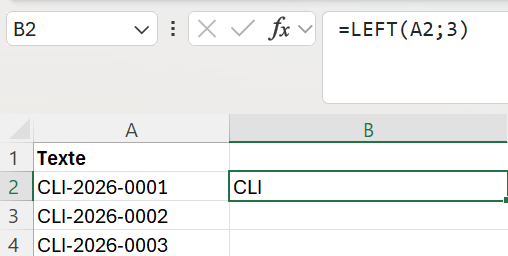
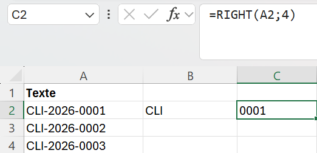
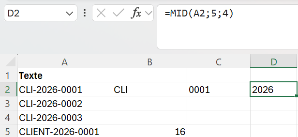

`LEFT` et `RIGHT` travaillent depuis une extrémité ; `MID` exige de connaître précisément la position de départ.
</details>

<details>
<summary><strong>Exercice 4 — Compter avec LEN</strong></summary>

```excel
=LEN(A2)
```

| Identifiant | Longueur | Conforme |
|:---|---:|:---|
| `CLI-2026-0001` | 13 | ✅ |
| `CLIENT-2026-0001` | 16 | ❌ |

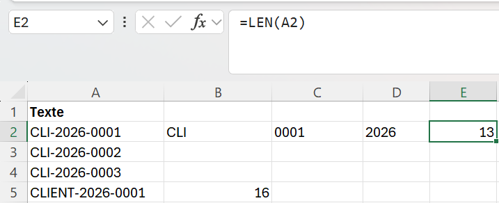
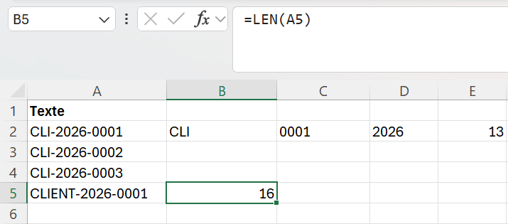

`LEN` compte aussi les tirets et les espaces. C'est précisément ce qui en fait un **outil de contrôle** : toute variation de longueur signale une variation de structure.

💡 C'est aussi le moyen le plus simple de détecter un espace invisible — un nom qui devrait compter 10 caractères et en compte 11.
</details>

<details>
<summary><strong>Exercice 5 — Nettoyer avec TRIM</strong></summary>

```excel
=TRIM(A8)
```

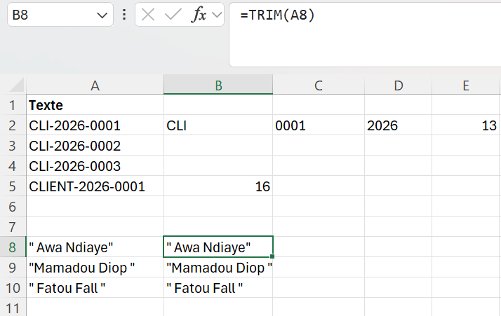

`TRIM` retire les espaces en début et en fin, et réduit à un seul les espaces multiples internes. Les espaces entre deux mots sont conservés.

⚠️ **Ce que TRIM ne fait pas :** supprimer les **espaces insécables** (code 160), fréquents dans les données copiées depuis le web. La parade : `=TRIM(SUBSTITUTE(A2;CHAR(160);" "))`. C'est le grand classique du « pourquoi cet espace ne part pas ».

Sans ce nettoyage, `"Dakar"` et `"Dakar "` sont deux valeurs différentes pour Excel — et toute comparaison échoue.
</details>

<details>
<summary><strong>Exercices 6 et 7 — Assembler avec CONCAT et TEXTJOIN</strong></summary>

```excel
=CONCAT(H4;" ";I4)              →  Awa Ndiaye
=TEXTJOIN(" - ";TRUE;L3:N3)     →  Dakar - Sénégal - Afrique
```

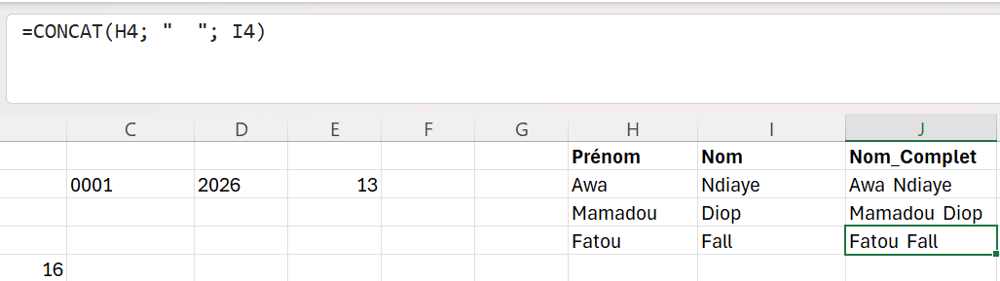
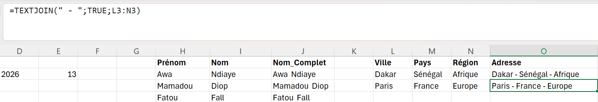

| | `CONCAT` | `TEXTJOIN` |
|:---|:---|:---|
| Séparateur | À répéter entre chaque élément | Défini une seule fois |
| Cellules vides | Produit des séparateurs en double | Ignorées si `TRUE` |
| Usage idéal | Deux ou trois éléments | Une plage entière |

💡 L'argument `TRUE` est le vrai atout de TEXTJOIN : sur une adresse sans complément, `CONCAT` laisserait `Dakar -  - Sénégal`, TEXTJOIN produit directement `Dakar - Sénégal`.
</details>

---

## 🧹 Mini-projet — Nettoyage d'une base de clients

Base d'environ 100 clients, avec des problèmes d'espacement et des identifiants structurés. Objectif : produire une structure propre **sans modifier manuellement une seule ligne**.

### Étape 1 — Nettoyer prénoms et noms

```excel
=TRIM(B2)     →  Prenom_Propre
=TRIM(C2)     →  Nom_Propre
```

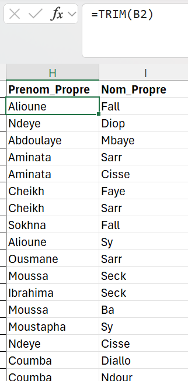
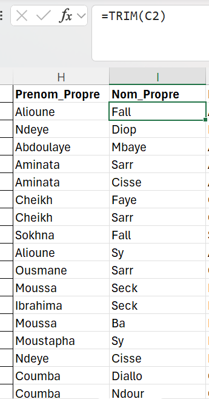

### Étape 2 — Construire le nom complet

```excel
=CONCAT(H2;" ";I2)
```

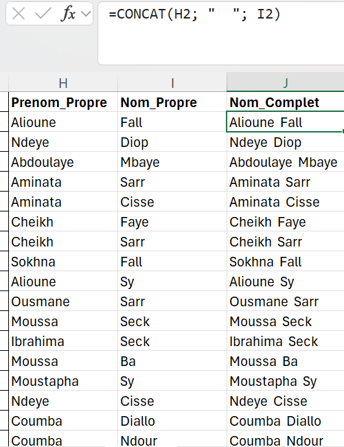

📌 Le nom complet est construit à partir des colonnes **déjà nettoyées**, pas des colonnes d'origine. Sinon les espaces parasites se retrouvent au milieu du résultat, là où ils sont bien plus difficiles à repérer.

### Étape 3 — Décomposer le Client_ID

| Colonne créée | Formule | Résultat | Signification |
|:---|:---|:---|:---|
| `Prefixe` | `=LEFT(A2;3)` | CLI | Type de client |
| `Annee` | `=MID(A2;5;4)` | 2026 | Année d'enregistrement |
| `Numero` | `=RIGHT(A2;4)` | 0001 | Numéro séquentiel |

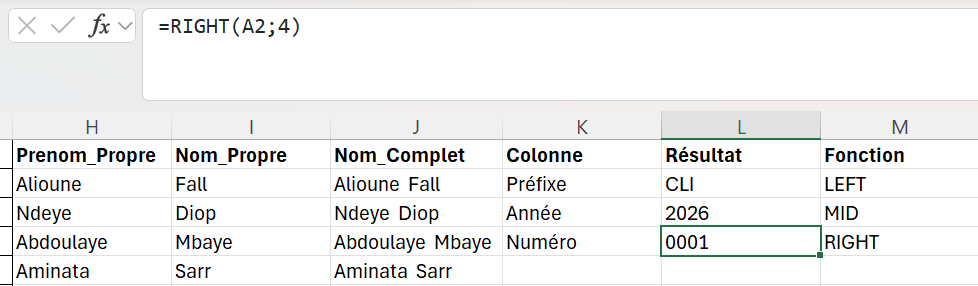

Un identifiant unique devient trois informations exploitables : il devient possible de compter les clients par année ou de filtrer par type.

### Étape 4 — Contrôler la longueur

```excel
=LEN(A2)
```

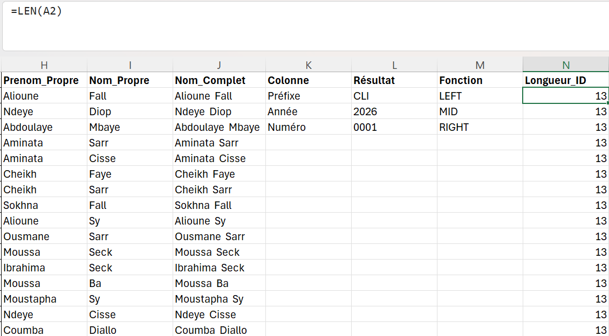

### Étape 5 — Regrouper la localisation

```excel
=TEXTJOIN(" - ";TRUE;F2:G2)     →  Dakar - Sénégal
```

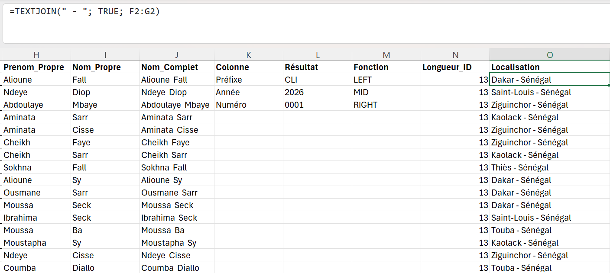

### Structure finale

| Colonne | Rôle | Exemple |
|:---|:---|:---|
| `Client_ID` | Identifiant d'origine | CLI-2026-0001 |
| `Prenom_Propre` / `Nom_Propre` | Nettoyés par TRIM | Alioune / Fall |
| `Nom_Complet` | Prénom + nom | Alioune Fall |
| `Prefixe` / `Annee` / `Numero` | Extraits de l'identifiant | CLI / 2026 / 0001 |
| `Longueur_ID` | Contrôle de structure | 13 |
| `Localisation` | Informations géographiques | Dakar - Sénégal |

💡 Une fois le nettoyage validé, les colonnes calculées peuvent être figées par **Collage spécial › Valeurs** (Jour 1). Les formules dépendent des colonnes d'origine : les supprimer sans figer ferait apparaître des `#REF!` partout.

---

## 🏆 Challenge — Détecter les identifiants atypiques

Trois structures cohabitent dans la base :

```text
CLI-2026-0001      (format standard, 13 caractères)
CLI-26-0001        (année sur 2 chiffres)
CLIENT-2026-001    (préfixe long, numéro court)
```

```excel
=IF(LEN(A2)<>13;"À vérifier";"Conforme")
```

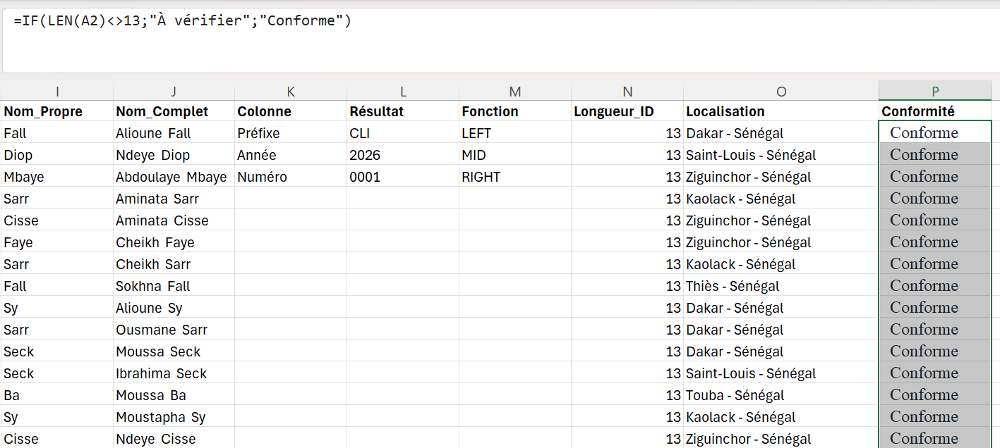
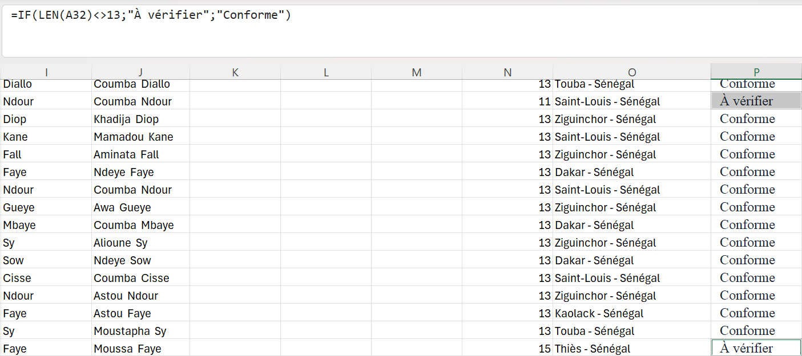

🔑 **Pourquoi détecter plutôt que corriger ?** `CLI-26-0001` peut désigner l'année 2026 **ou** 1926, et rien dans la donnée ne permet de trancher. Une correction automatique fabriquerait une information qui n'existe pas. Détecter, signaler, faire vérifier : c'est la seule démarche fiable.

📐 **Limite identifiée :** `LEFT`, `RIGHT` et `MID` travaillent sur des positions **fixes**. Sur `CLIENT-2026-001`, `=MID(A2;5;4)` renverrait `NT-2`. Une extraction robuste demanderait `FIND` pour repérer les tirets : `=MID(A2;FIND("-";A2)+1;4)`. C'est exactement le type de transformation que Power Query automatisera plus loin.

---

## 💡 Ce que j'ai retenu

```text
Donnée brute
      ↓
Nettoyage        (TRIM)
      ↓
Décomposition    (LEFT / MID / RIGHT)
      ↓
Contrôle         (LEN)
      ↓
Recomposition    (CONCAT / TEXTJOIN)
      ↓
Donnée exploitable
```

| Symptôme | Cause probable |
|:---|:---|
| Un espace résiste à `TRIM` | Espace insécable — `SUBSTITUTE` avec `CHAR(160)` |
| Mots collés | Séparateur oublié dans `CONCAT` |
| Comparaison qui échoue | Espace parasite non nettoyé d'un côté |
| Résultat vide | Position de départ au-delà de la longueur du texte |

---

## ✅ Statut

**Jour 9 terminé et validé.**
Compétence principale acquise : *nettoyer, décomposer et recomposer des données textuelles par formules, et contrôler la structure d'une donnée pour détecter les anomalies avant analyse.*

---

<sub>Ndeye Penda SARR — Apprenante Promotion 8, Développement Data · Orange Digital Center · 2026</sub>
