# 📅 Jour 10 — Fonctions de date

<p>
  
  
  
  
</p>

> **En une phrase :** une date n'est pas un texte affiché dans une cellule, c'est un **nombre**. C'est ce qui permet à Excel de la comparer, de la soustraire et d'en déduire une durée.

[⬅️ Retour au Sprint 1](../README.md) · [🏠 Sommaire du bootcamp](../../README.md)

---

## 📎 Livrables

| Fichier | Description |
|:---|:---|
| [📕 Rapport complet (PDF)](./documentation/Jour10_Excel_Fonctions_Date_Ndeye_Penda_SARR.pdf) | Version illustrée et détaillée, lisible directement dans GitHub |
| [📝 Rapport complet (Word)](./documentation/Jour10_Excel_Fonctions_Date_Ndeye_Penda_SARR.docx) | Version éditable du rapport |
| [📊 Classeur Excel](./exercices/Classeur-J10.xlsx) | Les 3 exercices et le système de gestion des congés |
| [📸 Captures](./captures/) | 11 preuves visuelles des manipulations |

---

## 🎯 Les six fonctions étudiées

| Fonction | Équivalent français | Rôle |
|:---|:---|:---|
| `TODAY()` | `AUJOURDHUI()` | Renvoyer la date du jour |
| `NOW()` | `MAINTENANT()` | Renvoyer la date **et** l'heure |
| `YEAR()` | `ANNEE()` | Extraire l'année |
| `MONTH()` | `MOIS()` | Extraire le numéro du mois |
| `DAY()` | `JOUR()` | Extraire le jour du mois |
| `DATEDIF()` | `DATEDIF()` | Calculer une durée entre deux dates |

---

## 🧩 Pourquoi Excel sait calculer avec des dates

Parce qu'une date est stockée comme un **nombre** : le compte des jours écoulés depuis le 1er janvier 1900.

```text
01/01/1900   →         1
01/01/2026   →    46 023
15/08/2026   →    46 249
```

La date affichée n'est qu'un **format** appliqué à ce nombre — exactement la distinction valeur / affichage du Jour 2. Soustraire deux dates revient donc à soustraire deux nombres.

⚠️ **Encore faut-il que la date soit reconnue comme telle.** Une date importée sous forme de texte s'aligne **à gauche** au lieu de la droite, et tout calcul échoue. L'alignement par défaut est le test visuel le plus rapide.

---

## 🧪 Exercices réalisés

<details>
<summary><strong>Exercice 1 — TODAY() et NOW()</strong></summary>

```excel
=TODAY()    →  08/09/2026
=NOW()      →  08/09/2026 22:56
```

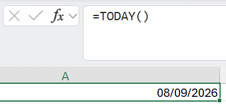
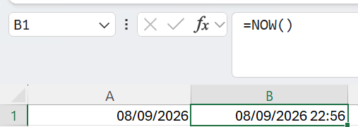

| | `TODAY()` | `NOW()` |
|:---|:---|:---|
| Renvoie | La date seule | La date et l'heure |
| Usage type | Calculs d'ancienneté, comparaisons | Horodatage d'une consultation |

⚠️ Ce sont des **fonctions volatiles**, comme `RAND()` du Jour 1 : elles se recalculent à chaque ouverture du fichier. Une colonne « Dernière mise à jour » construite avec `NOW()` n'enregistre donc pas la date de la dernière modification — elle affiche l'instant du **dernier recalcul**. Pour figer réellement une date, il faut la convertir par Collage spécial › Valeurs.
</details>

<details>
<summary><strong>Exercice 2 — Décomposer une date</strong></summary>

```text
        15/08/2026
             │
   ┌─────────┼─────────┐
 YEAR      MONTH      DAY
 2026        8         15
```

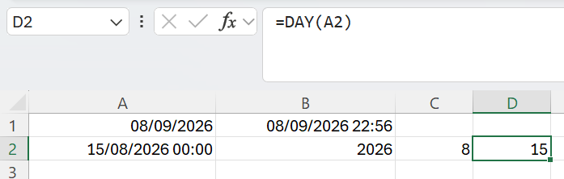

📌 `MONTH` renvoie un **numéro**, pas un nom de mois. Pour obtenir « août », il faut un format personnalisé ou la fonction `TEXT`.
</details>

<details>
<summary><strong>Exercice 3 — Calculer une durée avec DATEDIF</strong></summary>

Du 01/08/2026 au 15/08/2026 :

| Formule | Unité | Résultat |
|:---|:---|---:|
| `=DATEDIF(F2;G2;"d")` | Jours complets | **14** |
| `=DATEDIF(F2;G2;"m")` | Mois complets | 0 |
| `=DATEDIF(F2;G2;"y")` | Années complètes | 0 |

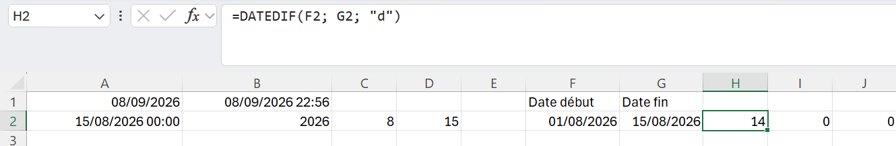
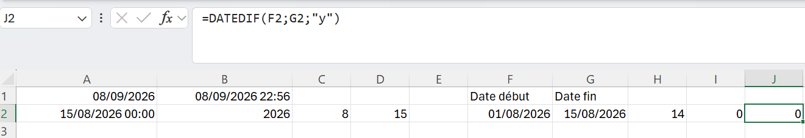

Les résultats en mois et années valent zéro car aucun mois ni aucune année **complète** ne sépare les deux dates. `DATEDIF` ne fait pas d'arrondi.

💡 **DATEDIF est une fonction cachée**, héritée d'un ancien tableur. Elle n'apparaît **ni dans l'assistant, ni dans la saisie semi-automatique** : Excel l'accepte mais ne la propose pas. Il faut la taper intégralement de mémoire.

⚠️ Si la date de début est postérieure à la date de fin, `DATEDIF` renvoie `#NUM!` au lieu d'un nombre négatif. C'est un contrôle de cohérence gratuit sur les données.
</details>

---

## 🏖️ Mini-projet — Système de gestion des congés

Feuille `Conges`, 20 employés. Cinq colonnes saisies, six calculées.

### Étape 1 — La durée du congé

```excel
=DATEDIF(D2;E2;"d")
```

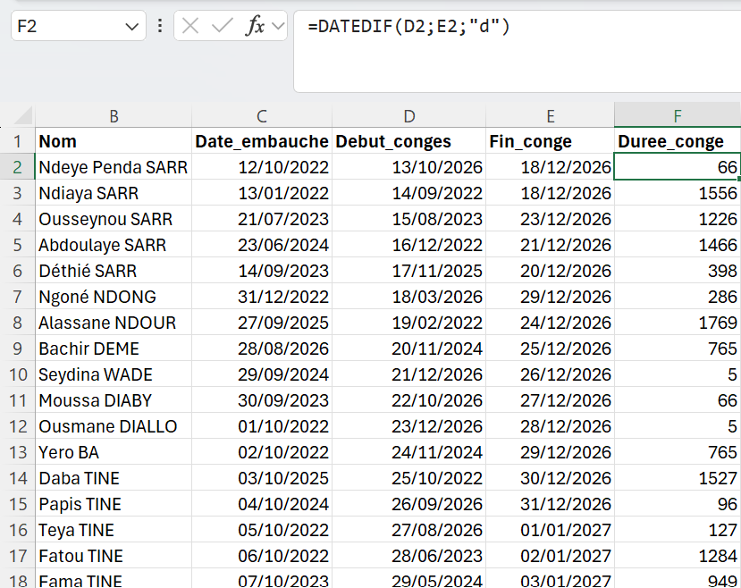

⚠️ **Une durée calculée est un écart, pas un décompte.** Sur la première ligne — congé du 13/10/2026 au 18/12/2026 — DATEDIF renvoie **66**, alors qu'un service RH compterait **67 jours** en incluant les deux bornes. Selon la règle métier, il faut parfois écrire `DATEDIF(...)+1`. La formule est juste dans les deux cas ; c'est la définition attendue qui doit être fixée avant.

### Étape 2 — Extraire les composantes

| Colonne | Formule |
|:---|:---|
| `Annee_conge` | `=YEAR(D2)` |
| `Mois_conge` | `=MONTH(D2)` |
| `Jour_conge` | `=DAY(D2)` |

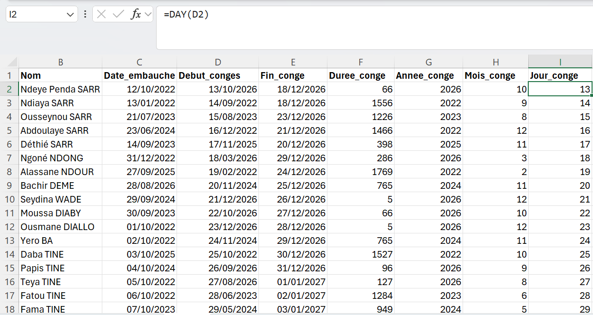

Ces trois colonnes rendent possibles des analyses que la date seule ne permettait pas : compter les congés par mois, comparer deux années, repérer les périodes de forte absence.

### Étape 3 — L'ancienneté

```excel
=DATEDIF(C2;TODAY();"y")
```

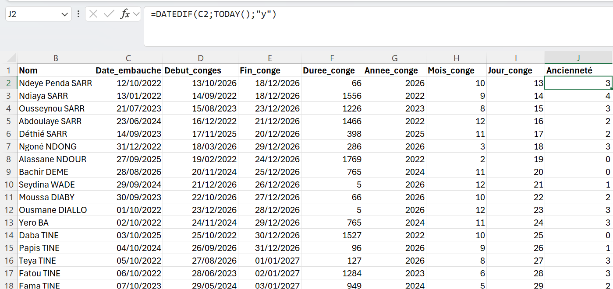

L'usage de `TODAY()` rend le calcul **dynamique** : l'ancienneté s'actualise seule au fil du temps. Même principe que le calculateur de salaire du Jour 6 — sauf qu'ici, la donnée variable référencée est le temps lui-même.

### Étape 4 — Les indicateurs temporels

```excel
Date du jour           :  =TODAY()
Derniere_mise_a_jour   :  =NOW()
```

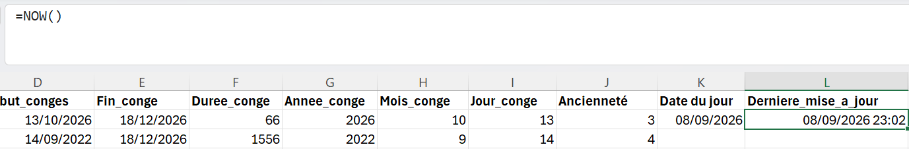

---

## 🏆 Challenge — Le statut des congés

| Statut | Condition |
|:---|:---|
| **À venir** | `TODAY() < Debut_conge` |
| **En cours** | `TODAY() >= Debut_conge` ET `TODAY() <= Fin_conge` |
| **Terminé** | `TODAY() > Fin_conge` |

```excel
=IF(TODAY()<D2;"À venir";
 IF(AND(TODAY()>=D2;TODAY()<=E2);"En cours";
 "Terminé"))
```

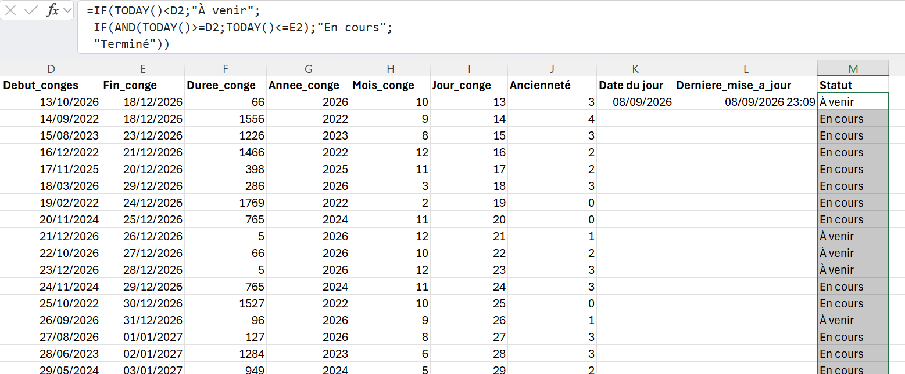

💡 Une écriture plus courte est possible : le `AND` est en réalité **facultatif**. Le second test n'est atteint que si le premier est faux, donc `TODAY()>=D2` est déjà garanti. `=IF(TODAY()<D2;"À venir";IF(TODAY()<=E2;"En cours";"Terminé"))` suffit. C'est l'imbrication qui porte la moitié de la condition — même logique que la décision d'admission du Jour 8.

Cette partie combine les deux journées : **les dates fournissent la donnée, les fonctions logiques produisent la décision.**

---

## 📊 Structure finale du tableau

| Colonne | Rôle | Origine |
|:---|:---|:---|
| `ID` / `Nom` | Identification | Saisie |
| `Date_embauche` | Entrée dans l'entreprise | Saisie |
| `Debut_conge` / `Fin_conge` | Bornes du congé | Saisie |
| `Duree_conge` | Durée en jours | `DATEDIF` |
| `Annee_conge` / `Mois_conge` / `Jour_conge` | Composantes de la date | `YEAR` / `MONTH` / `DAY` |
| `Anciennete` | Années dans l'entreprise | `DATEDIF` + `TODAY` |
| `Statut` | Situation du congé | `IF` + `AND` + `TODAY` |

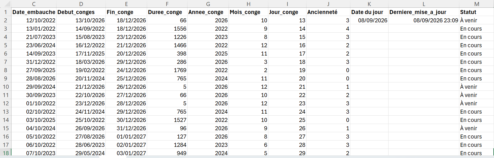

---

## 💡 Ce que j'ai retenu

| Besoin métier | Fonctions mobilisées |
|:---|:---|
| Ancienneté d'un salarié | `DATEDIF` + `TODAY` |
| Délai entre deux événements | `DATEDIF` ou soustraction |
| Échéances dépassées | `IF` + `TODAY` |
| Périodes en cours | `IF` + `AND` + `TODAY` |
| Analyse par année ou par mois | `YEAR` + `MONTH` |

🔭 Les colonnes `Annee` et `Mois` créées ici préfigurent la **table de dates** utilisée en Business Intelligence. En Power Pivot, c'est exactement ce mécanisme qui permettra d'analyser des ventes par trimestre ou de comparer deux exercices.

| Symptôme | Cause probable |
|:---|:---|
| `#NUM!` | Dates inversées dans `DATEDIF` |
| `#VALUE!` | La cellule contient du texte, pas une date |
| Un nombre à 5 chiffres s'affiche | Format Nombre au lieu de format Date |
| La date change toute seule | Fonction volatile — `TODAY` ou `NOW` recalculée |

---

## ✅ Statut

**Jour 10 terminé et validé — Sprint 1 clôturé. 🎉**

Compétence principale acquise : *manipuler les dates comme des valeurs calculables, extraire leurs composantes et construire des indicateurs temporels dynamiques combinés à des règles logiques.*

> En dix journées, Excel est passé d'un tableau où l'on saisit des données à un outil capable de **calculer, contrôler, décider et se mettre à jour seul**.

---

<sub>Ndeye Penda SARR — Apprenante Promotion 8, Développement Data · Orange Digital Center · 2026</sub>
